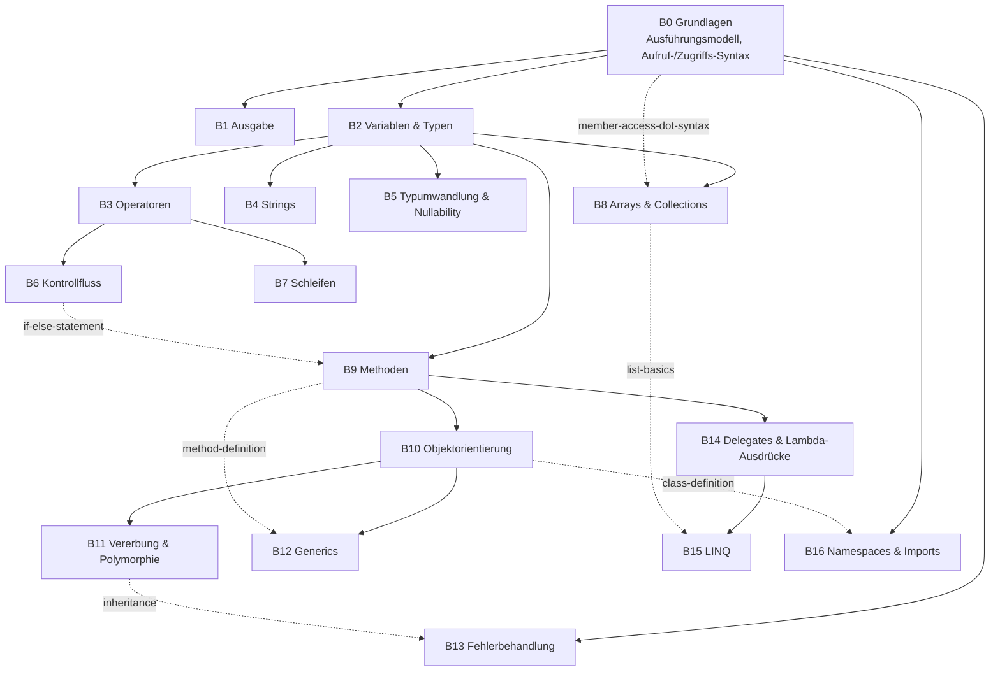
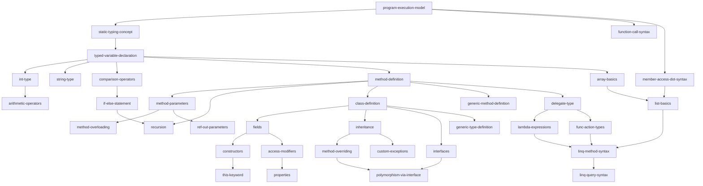

# C#-Konzept-Hierarchie (Planungsdokument)

Gleiche Methodik wie [`docs/sql-concept-hierarchy.md`](sql-concept-hierarchy.md)
und [`docs/python-concept-hierarchy.md`](python-concept-hierarchy.md): kein
Abbild existierender Challenges (für C# gibt es aktuell **keine einzige**,
siehe Abschnitt 6), sondern der Versuch, **den vollständigen Konzeptraum von
C#** (im Rahmen einer Lern-Scope-Grenze, siehe Abschnitt 7) als Tag-DAG zu
erfassen. Wo sich C# strukturell anders verhält als SQL und Python, wird das
explizit benannt statt eine der beiden Vorgänger-Strukturen blind zu
kopieren — alle drei Dokumente sind bewusst **unabhängige Graphen**, keine
Unterbäume eines gemeinsamen Ober-Graphen (Begründung: Abschnitt 8).

Neu gegenüber den ersten beiden Dokumenten: **alle Levels in diesem Dokument
wurden von Anfang an mechanisch berechnet**, nicht von Hand geschätzt und
im Nachhinein per Skript geprüft. Grund: Im SQL-Dokument gab es mehrere
Hand-Rechenfehler (siehe dortige Historie), im Python-Dokument bereits keine
mehr, weil das Skript von Anfang an mitlief. Für C# wurde diese Lektion
direkt umgesetzt — das erste Mal, dass die grobe Tiefen-Schätzung vor der
Berechnung (siehe Abschnitt 8) sich sogar als **falsch** herausstellte, was
selbst noch einmal bestätigt, warum Nachrechnen Pflicht ist, keine
Formsache.

## 1. Grundprinzipien

Dieselben zehn Prinzipien wie im SQL-Dokument gelten unverändert (Tag-
Granularität, DAG statt Levels, Syntax+Semantik pro Tag, Kursreihenfolge ≠
Graph, n:m zwischen Challenge und Tag, nicht jedes Tag eine Challenge,
Bündelung vs. Trennung, Zweig-Modell-Ausnahmen, Syntax-Verständnis explizit
Teil jedes Tags). Hier nur, was für C# **anders** ist oder eine neue
Illustration verdient.

### 1.1 Weder „Variablen" noch „das relationale Modell" — die Wurzel ist statische Typisierung

SQL verwarf „Variablen als Grundlage" (deklarativ, Wurzel ist das
relationale Modell). Python bestätigte die Prämisse fast wörtlich
(`variable-assignment` auf Level 1). **C# ist ein dritter Fall:** Eine
Variable zu deklarieren ist hier nicht von ihrem Typ trennbar — `int x = 5;`
ist syntaktisch **ein** Konstrukt, nicht „Variable plus optionale
Typangabe" wie in Python. Deshalb ist die tatsächliche Wurzel unterhalb
aller Typen `static-typing-concept` (Level 1: *jede Variable hat einen zur
Kompilierzeit feststehenden Typ*) — ein Konzept, das in Python nie benannt
werden musste (dort ist `dynamic-typing` selbst erst Level 3 und beschreibt
das Fehlen genau dieser Eigenschaft). `typed-variable-declaration` (Level 2)
baut direkt darauf auf, und **jeder** einzelne Typ-Tag (`int-type`,
`string-type`, …) baut wiederum auf `typed-variable-declaration`, nicht auf
einer typlosen Zuweisung. Das ist der deutlichste strukturelle Unterschied
zu Python in der gesamten unteren Graphhälfte.

### 1.2 Die Ausgangsfrage, dritte Antwort: C# hat MEHR Parameter-Varianten als Python

SQL beantwortete die Frage nur für eingebaute Funktionsaufrufe. Python
lieferte die erste echte Definitions-Kette: `function-definition` →
`function-parameters` → `default-parameters`. **C# reproduziert diese Kette
wortwörtlich** (`method-definition` → `method-parameters` →
`optional-parameters`) — bestätigt die Python-Antwort erneut — **fügt aber
drei zusätzliche, in Python nicht existierende Verzweigungen** direkt auf
`method-parameters` hinzu:

1. `method-overloading` — dieselbe Methode mehrfach mit unterschiedlicher
   Parameter-*Signatur* (nicht Werten). In Python unmöglich (späte
   Definition überschreibt die frühere einfach), hier nur möglich, weil der
   Compiler Signaturen statisch unterscheidet — eine direkte Folge von 1.1.
2. `ref-out-parameters` — Parameter explizit per Referenz statt per Wert,
   ein Konzept, das es in Python schlicht nicht gibt (dort sind Namen immer
   Referenzen auf Objekte, nie umschaltbar).
3. `params-array` — das C#-Äquivalent zu Pythons `*args`, aber als eigener
   Tag, weil es syntaktisch ein Array-Typ-Präfix (`params int[] werte`) ist,
   kein generisches Tupel-Packing.

Damit ist die Antwort auf die Ausgangsfrage für C# **reichhaltiger** als für
Python: „Funktion mit bestimmten Parametern baut auf der Funktion auf" gilt
nicht nur für Default-Werte, sondern verzweigt in drei unabhängige,
gleichrangige C#-spezifische Parameter-Varianten.

### 1.3 Ein drittes Kursreihenfolge-≠-Graph-Beispiel: Top-Level-Statements vs. Klassen

Modernes C# (seit C# 9) erlaubt Anweisungen direkt in `Program.cs`, ohne
sichtbare `class Program { static void Main(...) { ... } }`-Hülle —
`top-level-statements` (Level 1). Das ist strukturell exakt die gleiche
didaktische Entscheidung wie Pythons implizites Verstecken von
`if __name__ == "__main__":`: den Einstiegspunkt-Boilerplate so lange wie
möglich unsichtbar lassen. Im Graphen hängt `top-level-statements` direkt
und ausschließlich von `program-execution-model` ab — **`class-definition`
(B10) hängt nicht von `top-level-statements` ab**, sondern von
`method-definition` (B9). Ein Kurs *lehrt* Top-Level-Statements zuerst und
Klassen viel später, aber strukturell sind sie keine Kette, sondern zwei
unabhängige Zweige derselben Wurzel — das dritte Beispiel dieser Art nach
SQL 6.1 und Python 1.3.

### 1.4 Ein Tag ohne SQL/Python-Pendant: `value-vs-reference-types` als „Stolperstein"

`struct` (Werttyp, Kopiersemantik) vs. `class` (Referenztyp,
Zeigersemantik) ist ein Konzept, das weder SQL noch Python dem Lernenden
exponieren — Python-Objekte sind immer referenzartig, SQL kennt keine
Zuweisungs-Semantik in diesem Sinne. Der Tag `value-vs-reference-types`
braucht deshalb **zwei** Voraussetzungen aus verschiedenen Zweigen
gleichzeitig: `class-definition` (um zu wissen, was ein Referenztyp
überhaupt ist) und `int-type` (als vertrauter Vertreter eines Werttyps) —
ein bewusst als „Stolperstein" markierter Tag, der erst *nach* dem
Kennenlernen von Klassen wirklich verstehbar wird, obwohl `int-type` selbst
ganz am Anfang steht.

### 1.5 `access-modifiers` vs. Pythons `encapsulation-convention`

Python markiert Kapselung nur über Namenskonvention
(`encapsulation-convention`, B14 im Python-Dokument: `_privat`/`__name`,
sozial durchgesetzt, vom Interpreter nicht wirklich verhindert). C#s
`access-modifiers` (`public`/`private`/`protected`) sind demgegenüber vom
Compiler **erzwungen** — ein Zugriffsversuch auf ein `private`-Feld von
außen ist ein Kompilierfehler, kein Stilbruch. Gleiche pädagogische
Position im Graphen (beide bauen auf dem Feld-/Attribut-Konzept auf),
fundamental andere Semantik — ein Kontrastpaar, das sich lohnt, in beiden
Dokumenten zu verlinken (siehe Abschnitt 8).

### 1.6 LINQ: derselbe Fall wie SQL/Python „Wiederholung", aber schärfer

Vorgriff auf Abschnitt 8: `linq-query-syntax` (`from x in coll where ...
select ...`) ist nahezu Token für Token SQLs `SELECT ... FROM ... WHERE
...`. Trotzdem sitzt es auf **Level 7** — fast der tiefste Punkt im
gesamten C#-Graphen — während SQLs eigenes `select-statement`/`where-clause`
zu den **flachsten** Tags im SQL-Graphen gehören. Dieselbe Oberflächen-
Syntax liegt also in den beiden Sprachen an entgegengesetzten Enden der
jeweiligen Tiefe — eine noch schärfere Illustration desselben Prinzips, das
Python Abschnitt 8 für „Wiederholung" (SQL `recursive-cte` vs. Python
`for-loop`) etabliert hat.

### 1.7 Zweig-Modell-Ausnahmen: die meisten von allen drei Dokumenten

C# hat mehr dokumentierte Ausnahmen vom vereinfachten Zweig-Überblick
(Abschnitt 3) als SQL oder Python — Konsequenz einer objektorientierten
Sprache, in der viele fortgeschrittene Features strukturell „eine Klasse,
die X tut" sind:

- `recursion` (B9 Methoden) braucht `if-else-statement` (B6) für den
  Basisfall.
- `generic-method-definition` (B12) braucht nur `method-definition` (B9);
  `generic-constraints` (B12) baut aber auf `generic-type-definition` auf,
  das wiederum `class-definition` (B10) braucht — B12 hat also zwei
  unabhängige Elternzweige, B9 und B10.
- `custom-exceptions` (B13 Fehlerbehandlung) braucht `inheritance` (B11),
  weil eine eigene Exception-Klasse von `Exception` erben muss.
- `linq-method-syntax` (B15) braucht sowohl `lambda-expressions`/
  `func-action-types` (B14) als auch `list-basics` (B8) — zwei Eltern aus
  zwei verschiedenen, sonst unabhängigen Zweigen.
- `own-namespaces` (B16) braucht sowohl `using-directive` (Level 1, ganz
  am Anfang) als auch `namespace-declaration`, das über `class-definition`
  (B10) erst spät im Graphen ankommt — B16 „Namespaces & Imports" ist damit
  der einzige Zweig, der buchstäblich vom flachsten bis fast zum tiefsten
  Level reicht.

## 2. Was ein Tag NICHT ist

Wie in den ersten beiden Dokumenten (SQL Abschnitt 2): keine Dialekt-/
Versions-Anmerkungen (z. B. „`record`-Typen erst ab C# 9",
„Pattern-Matching-Erweiterungen erst ab C# 11") als eigene Knoten — das ist
eine Annotation, keine Voraussetzung. Ebenso ist „Übung/Wiederholung" kein
Tag.

## 3. Zweig-Überblick

Anders als bei SQL und Python fächert sich C# nicht nach einer kurzen
linearen Basis rein baumartig auf — die gestrichelten Kanten zeigen, dass
mehrere Zweige (B9, B12, B15, B16) **zwei unabhängige Eltern** haben. Das
ist die direkte grafische Konsequenz von Abschnitt 1.7.

## 4. Tag-Katalog

Levels mechanisch berechnet (`level(tag) = 1 + max(level(voraussetzung))`,
0 falls keine Voraussetzung) — Skript-Ergebnis, keine Handrechnung (siehe
Kopf des Dokuments).

### B0 — Grundlagen

| Tag | Label | Voraussetzungen | Level |
|---|---|---|---|
| `program-execution-model` | Programm = sequenzielle Anweisungen, `;` als Anweisungsende, `{ }` als Blockklammern | — | 0 |
| `top-level-statements` | Anweisungen direkt in `Program.cs`, ohne sichtbare `class`/`Main`-Hülle (moderner Einstiegspunkt) | `program-execution-model` | 1 |
| `function-call-syntax` | `Name(args)` als Ausdruck | `program-execution-model` | 1 |
| `member-access-dot-syntax` | `objekt.Member` / `Typ.StatischesMember` | `program-execution-model` | 1 |
| `comments` | `//` und `/* */` | `program-execution-model` | 1 |

### B1 — Ausgabe

| Tag | Label | Voraussetzungen | Level |
|---|---|---|---|
| `console-write-line` | `Console.WriteLine(...)`, String-Literale | `function-call-syntax`, `member-access-dot-syntax` | 2 |

### B2 — Variablen & Typen

| Tag | Label | Voraussetzungen | Level |
|---|---|---|---|
| `static-typing-concept` | Jede Variable hat einen zur Kompilierzeit feststehenden, unveränderlichen Typ | `program-execution-model` | 1 |
| `typed-variable-declaration` | `Typ name = wert;` — Typ und Name gemeinsam deklariert | `static-typing-concept` | 2 |
| `int-type` | Ganzzahlen (`int`) | `typed-variable-declaration` | 3 |
| `double-type` | Kommazahlen (`double`) | `typed-variable-declaration` | 3 |
| `string-type` | Text (`string`) | `typed-variable-declaration` | 3 |
| `bool-type` | `true`/`false` als Werte (`bool`) | `typed-variable-declaration` | 3 |
| `char-type` | Einzelzeichen (`char`), `'x'` vs. `"x"` | `typed-variable-declaration` | 3 |
| `var-type-inference` | `var x = 5;` — Typ wird vom Compiler abgeleitet, bleibt aber statisch fixiert | `typed-variable-declaration` | 3 |
| `constants-readonly` | `const`/`readonly` — Wert nach Initialisierung unveränderlich | `typed-variable-declaration` | 3 |

### B3 — Operatoren

| Tag | Label | Voraussetzungen | Level |
|---|---|---|---|
| `arithmetic-operators` | `+ - * /` | `int-type` | 4 |
| `integer-division-modulo` | `/` bei `int` liefert `int` (Abschneiden), `%` Rest | `arithmetic-operators` | 5 |
| `comparison-operators` | `== != < > <= >=` | `typed-variable-declaration` | 3 |
| `boolean-logic-operators` | `&& \|\| !` | `bool-type`, `comparison-operators` | 4 |
| `compound-assignment-operators` | `+= -= *= /=` | `arithmetic-operators` | 5 |
| `increment-decrement-operators` | `++ --` | `int-type` | 4 |

### B4 — Strings

| Tag | Label | Voraussetzungen | Level |
|---|---|---|---|
| `string-concatenation` | `+` bei Strings | `string-type` | 4 |
| `string-interpolation` | `$"...{ausdruck}..."` | `string-type` | 4 |
| `string-methods` | `.Length`, `.Substring()`, `.ToUpper()`, `.Trim()` | `string-type`, `member-access-dot-syntax` | 4 |

### B5 — Typumwandlung & Nullability

| Tag | Label | Voraussetzungen | Level |
|---|---|---|---|
| `explicit-type-casting` | `(int)x`, `Convert.ToInt32(...)` | `int-type`, `double-type` | 4 |
| `nullable-value-types` | `int?` — Werttypen sind normalerweise nicht `null`-fähig, `?` macht sie es explizit | `typed-variable-declaration` | 3 |
| `null-conditional-operator` | `?.` — Zugriff nur wenn nicht `null`, sonst `null` | `nullable-value-types`, `member-access-dot-syntax` | 4 |
| `null-coalescing-operator` | `??` — Ersatzwert falls `null` | `nullable-value-types` | 4 |

### B6 — Kontrollfluss

| Tag | Label | Voraussetzungen | Level |
|---|---|---|---|
| `if-else-statement` | `if`/`else`, `{ }` als Blockgrenze | `comparison-operators` | 4 |
| `else-if-chain` | Beliebig viele `else if` zwischen `if` und `else` | `if-else-statement` | 5 |
| `switch-statement` | `switch`/`case`/`break` | `comparison-operators` | 4 |
| `ternary-operator` | `bedingung ? a : b` als Ausdruck | `if-else-statement` | 5 |
| `pattern-matching-switch` | `switch`-Ausdruck mit Pattern (`x switch { 1 => ..., _ => ... }`) | `switch-statement` | 5 |

### B7 — Schleifen

| Tag | Label | Voraussetzungen | Level |
|---|---|---|---|
| `while-loop` | `while (bedingung) { }` | `comparison-operators` | 4 |
| `for-loop` | `for (init; bedingung; schritt) { }` | `arithmetic-operators`, `comparison-operators` | 5 |
| `do-while-loop` | `do { } while (bedingung);` — Rumpf mindestens einmal | `while-loop` | 5 |
| `break-continue` | Schleife vorzeitig verlassen/überspringen | `for-loop`, `while-loop` | 6 |
| `nested-loops` | Schleife in Schleife | `for-loop` | 6 |

### B8 — Arrays & Collections

| Tag | Label | Voraussetzungen | Level |
|---|---|---|---|
| `array-basics` | `int[] arr = new int[n];`, Index-Zugriff, `.Length` | `typed-variable-declaration` | 3 |
| `foreach-loop` | `foreach (var x in coll) { }` | `array-basics` | 4 |
| `list-basics` | `List<T>`, spitze Klammern zur Typangabe, `.Add()`, `.Remove()`, `.Count` | `array-basics`, `member-access-dot-syntax` | 4 |
| `dictionary-basics` | `Dictionary<TKey, TValue>`, Zugriff, `.ContainsKey()` | `list-basics` | 5 |

### B9 — Methoden

| Tag | Label | Voraussetzungen | Level |
|---|---|---|---|
| `method-definition` | `RückgabeTyp Name(...) { ... }` | `typed-variable-declaration` | 3 |
| `method-parameters` | `RückgabeTyp Name(Typ x, Typ y) { ... }` — mehrere typisierte Parameter | `method-definition` | 4 |
| `return-statement` | `return wert;` | `method-definition` | 4 |
| `method-overloading` | Mehrere Methoden gleichen Namens, unterschiedliche Signatur | `method-parameters` | 5 |
| `optional-parameters` | Standardwerte: `int x = 0` | `method-parameters` | 5 |
| `ref-out-parameters` | `ref`/`out` — Parameter explizit per Referenz | `method-parameters` | 5 |
| `params-array` | `params int[] werte` — variable Argumentanzahl | `method-parameters` | 5 |
| `recursion` | Eine Methode ruft sich selbst auf | `method-definition`, `if-else-statement` | 5 |

### B10 — Objektorientierung

| Tag | Label | Voraussetzungen | Level |
|---|---|---|---|
| `class-definition` | `class Name { }` — kapselt Felder und Methoden | `method-definition` | 4 |
| `fields` | Typisierte Instanzvariablen einer Klasse | `class-definition` | 5 |
| `constructors` | `public Name(...) { this.x = x; }` | `fields` | 6 |
| `this-keyword` | Verweis auf aktuelle Instanz, löst Namenskollision Feld/Parameter | `constructors` | 7 |
| `access-modifiers` | `public`/`private`/`protected` — explizite Sichtbarkeit statt Konvention | `fields` | 6 |
| `properties` | `public int X { get; set; }` | `fields`, `access-modifiers` | 7 |
| `static-members` | `static` Felder/Methoden — klassen- statt instanzgebunden | `class-definition` | 5 |
| `value-vs-reference-types` | `struct`/Werttyp vs. `class`/Referenztyp — Kopier- vs. Zeigerverhalten | `class-definition`, `int-type` | 5 |

### B11 — Vererbung & Polymorphie

| Tag | Label | Voraussetzungen | Level |
|---|---|---|---|
| `inheritance` | `class Kind : Basis { }` | `class-definition` | 5 |
| `method-overriding` | `virtual` in der Basisklasse, `override` in der abgeleiteten Klasse | `inheritance` | 6 |
| `base-keyword` | `base(...)` — expliziter Aufruf des Basis-Konstruktors/-Methode | `inheritance`, `constructors` | 7 |
| `abstract-classes` | `abstract class`, `abstract` Methoden ohne Implementierung | `inheritance` | 6 |
| `interfaces` | `interface INam { }`, `class X : INam { }` | `class-definition` | 5 |
| `polymorphism-via-interface` | Variable vom Interface-/Basisklassen-Typ, tatsächliche Implementierung erst zur Laufzeit bestimmt | `interfaces`, `method-overriding` | 7 |
| `sealed-classes` | `sealed` verhindert weitere Vererbung | `inheritance` | 6 |

### B12 — Generics

| Tag | Label | Voraussetzungen | Level |
|---|---|---|---|
| `generic-type-definition` | Eigene generische Klasse: `class Box<T> { }` | `class-definition` | 5 |
| `generic-method-definition` | `T Max<T>(T a, T b) { ... }` | `method-definition` | 4 |
| `generic-constraints` | `where T : IComparable` — Einschränkung auf zulässige Typen | `generic-type-definition` | 6 |

### B13 — Fehlerbehandlung

| Tag | Label | Voraussetzungen | Level |
|---|---|---|---|
| `runtime-exceptions-concept` | Code kann zur Laufzeit eine Exception werfen | `program-execution-model` | 1 |
| `try-catch` | `try { } catch (Exception e) { }` | `runtime-exceptions-concept` | 2 |
| `specific-exception-types` | `DivideByZeroException`, `NullReferenceException`, `IndexOutOfRangeException` gezielt fangen | `try-catch` | 3 |
| `finally-block` | `finally { }` — läuft immer, auch nach `catch` | `try-catch` | 3 |
| `throw-statement` | Eigene Exception auslösen: `throw new Exception(...)` | `try-catch` | 3 |
| `custom-exceptions` | Eigene Exception-Klasse, von `Exception` abgeleitet | `throw-statement`, `inheritance` | 6 |

### B14 — Delegates & Lambda-Ausdrücke

| Tag | Label | Voraussetzungen | Level |
|---|---|---|---|
| `delegate-type` | `delegate int Op(int a, int b);` — Typ für eine Methodensignatur | `method-definition` | 4 |
| `lambda-expressions` | `(x, y) => x + y` — anonyme Inline-Funktion als Delegate-Wert | `delegate-type` | 5 |
| `func-action-types` | Eingebaute generische Delegate-Typen `Func<T,...>`, `Action<T>` statt eigenem `delegate` | `delegate-type` | 5 |
| `events` | `event`-Schlüsselwort — Delegate mit eingeschränktem Zugriff (nur Abonnieren von außen) | `delegate-type` | 5 |

### B15 — LINQ

| Tag | Label | Voraussetzungen | Level |
|---|---|---|---|
| `linq-method-syntax` | `.Where(x => ...)`, `.Select(x => ...)` auf `IEnumerable<T>` | `lambda-expressions`, `list-basics`, `func-action-types` | 6 |
| `linq-query-syntax` | `from x in coll where ... select ...` — SQL-paralleles Syntax-Sugar für dieselbe Semantik | `linq-method-syntax` | 7 |
| `linq-ordering-grouping` | `.OrderBy()`, `.OrderByDescending()`, `.GroupBy()` | `linq-method-syntax` | 7 |
| `linq-aggregation` | `.Sum()`, `.Count()`, `.Average()`, `.Max()`/`.Min()` | `linq-method-syntax` | 7 |
| `linq-deferred-execution` | Auswertung erst beim Iterieren des Ergebnisses, nicht beim Aufruf von `.Where()`/`.Select()` | `linq-method-syntax` | 7 |

### B16 — Namespaces & Imports

| Tag | Label | Voraussetzungen | Level |
|---|---|---|---|
| `namespace-declaration` | `namespace Projekt { }` | `class-definition` | 5 |
| `using-directive` | `using System;` | `program-execution-model` | 1 |
| `own-namespaces` | Mehrteilige Projekte mit eigenen Namespaces importieren | `namespace-declaration`, `using-directive` | 6 |

## 5. Detail-Graph (Kern-Zweige)

## 6. Abgleich mit der aktuellen Implementierung

Anders als SQL (damals 43/82, Stand inzwischen 59/82) und Python (damals
20/82, Stand inzwischen 66/82 — siehe die jeweiligen Dokumente für den
aktuellen Stand, hier absichtlich als historischer Vergleichswert zum
Zeitpunkt der Ersterhebung belassen) gab es für C# zu diesem Zeitpunkt
**keine Implementierung, die abgeglichen werden könnte** — bestätigt per
`grep -rn "csharp\|C#\|CSharp" src --include="*.ts"`: die einzigen vier
Treffer sind reine Kommentar-Erwähnungen als Zukunfts-Platzhalter in
`LanguagePlugin.ts`, `Runtime.ts`, `challenge.types.ts` und `stars.ts` —
kein einziges tatsächliches Challenge-, Engine- oder Validierungs-Modul für
C# existiert.

**Bilanz: 0 von 86 Tags abgedeckt (0 %), 17 von 17 Zweigen komplett
Lücke.** Das ist kein Fehler in der Erhebung, sondern der tatsächliche
Stand — dieses Dokument ist damit vollständig **Planungsraum ohne
Implementierungs-Anker**, anders als die ersten beiden Dokumente, die
zumindest teilweise an echten Challenges verifiziert werden konnten. Jede
Aussage über C#-Struktur in diesem Dokument stammt aus Sprachwissen über
C# selbst, nicht aus Code-Beobachtung im Repository.

*Update 2026-08-08: Es gibt inzwischen einen ersten Implementierungs-Anker
— allerdings Engine-Infrastruktur, keine Inhalte. `csharp-engine/` (neues
Top-Level-Verzeichnis, kein `src/`) ist ein echtes, ins Git eingechecktes
Blazor-WASM-Projekt, das über Roslyn (`CSharpCompilation`) echten C#-Code
kompiliert und im Browser ausführt — verifiziert per `dotnet build` und
einem echten `dotnet run` + Playwright-Smoke-Test. Das ist Schritt 2 der
Restliste in `docs/csharp-engine-poc.md` ("Scaffold der Projektstruktur");
`src/` selbst bleibt unverändert bei 0 Treffern, und die Tag-Bilanz bleibt
bei 0/86, weil hier noch keine Challenges, kein `src/runtime/csharp/`-
Loader und keine `CSharpChallenge`-Typen existieren — nur der Compiler
läuft schon.*

*Update 2026-08-08 (stündliche Routine, Fortsetzung): Schritt 3 der
Restliste ist jetzt ebenfalls abgeschlossen —
`src/runtime/csharp/csharpEngine.ts` existiert und lädt/bootet den
Blazor-Motor im Browser (`loadCSharpEngineFromServer` + `exec()`/`reset()`
über `createCSharpEngine`), live gegen den echten kompilierten
Blazor+Roslyn-Bundle verifiziert (Erfolg, Compiler-Fehler und
Laufzeit-Exception kommen alle korrekt durch). Die Tag-Bilanz bleibt
trotzdem bei 0/86: ein Ausführungs-Loader ist noch kein Inhalts-Track —
es existieren weiterhin keine `CSharpChallenge`-Typen, kein
`csharp`-Content-Verzeichnis unter `src/content/tracks/` und keine einzige
Challenge. Nächster Schritt laut `docs/csharp-engine-poc.md`: die
`validate()`-Design-Entscheidung (Schritt 4) — erst danach kann die
Tag-Bilanz hier überhaupt anfangen sich zu bewegen.*

*Update 2026-08-09 (stündliche Routine, Fortsetzung): Schritt 4 ist jetzt
ebenfalls entschieden — **stdout-only**. `Console.WriteLine` ist der
natürliche Weg für Einsteiger-C#, Ausgabe zu erzeugen (genaue Parallele zu
Pythons `print()`), und dieses Projekt nutzt `stdout`-Prüfungen in
Python-Validatoren bereits als etabliertes Muster. Die Alternative
(Ergebnisse über `public static`-Felder einer bekannten Klasse
zurückmelden, per Reflection ausgelesen) wurde bewusst verworfen — sie
hätte schon die allererste Lektion gezwungen, `static` zu benutzen, obwohl
`static-members` laut Tag-Katalog oben ein Level-6-Tag in B10 ist, den der
Kurs an dieser Stelle noch gar nicht erklärt hätte. Als direkte Folge:
Das seit Schritt 3 nur als Platzhalter vorhandene, nie befüllte
`result`-Feld wurde aus `CSharpExecResult` (`src/runtime/csharp/
CSharpRuntime.ts`) und aus dem C#-Treiber selbst (`csharp-engine/
CSharpEngine.cs`) entfernt und die Änderung live gegen den echten
kompilierten Bundle erneut bestätigt (Erfolgs- und Compiler-Fehler-Pfad).
Tag-Bilanz bleibt bei 0/86 — eine Design-Entscheidung ist noch kein
Content-Track. Nächster Schritt: Schritt 5, das mechanische Scaffolding
des `csharp`-Content-Tracks (keine offenen Design-Fragen mehr).*

*Update 2026-08-09 (stündliche Routine, Fortsetzung): Schritt 5 zum Teil
erledigt — `src/content/tracks/csharp/types.ts` (`CSharpChallenge`-Typ)
und `src/content/tracks/csharp/courses/csharpGrundlagen/course.ts` (noch
`challenges: []`, exakt nach dem Vorbild von `pythonGrundlagenCourse`)
existieren jetzt, ebenso `csharpChallengeSchema` in
`src/content/schema.ts`. Bewusst NICHT in `src/content/registry.ts`s
`TRACKS` eingetragen — das würde „C#" sofort als echten, wählbaren Kurs
in der Live-Kurs-Auswahl erscheinen lassen (die UI iteriert `TRACKS`
generisch, keine weitere Code-Änderung nötig), obwohl vier Lücken noch
offen sind, bevor ein ausgewählter C#-Kurs tatsächlich funktionieren
würde: kein C#-Fall in der Engine-Fabrik (`ctx.engines`), kein
C#-`LanguagePlugin` für den Editor, keine servierte Blazor-Bundle-Quelle
in Dev/Prod, und (logisch vorausgesetzt) noch keine einzige Challenge.
Tag-Bilanz bleibt bei 0/86 — ein leerer, unregistrierter Kurs ist noch
kein Content. Nächster Schritt: Schritt 6 (Node-Testmotor für CI) kann
unabhängig von den vier oben genannten Live-UI-Lücken weitergehen, da er
nur die jetzt existierenden Typen braucht, nicht die Live-Registrierung.*

*Update 2026-08-09 (stündliche Routine, Fortsetzung): Schritt 6 jetzt
fertig — `test/helpers/nodeCSharpEngine.ts` plus ein eigenes, separat
eingechecktes Desktop-.NET-Treiberprojekt (`csharp-engine/driver/`,
`CSharpDriver.csproj`), das dieselbe `CSharpCompilation`-Pipeline wie
`CSharpEngine.cs` implementiert, aber über `AppContext.GetData(
"TRUSTED_PLATFORM_ASSEMBLIES")` statt über `HttpClient`-Fetches gegen
`wwwroot/refs/` an Referenz-Assemblies kommt (auf Desktop-.NET funktioniert
`Assembly.Location` normal, anders als unter Mono/WASM). Ein `dotnet run`
gegen ein frisches Temp-Projekt pro `exec()`-Aufruf wurde verworfen (NuGet-
Restore + vollständiger Build bei jedem Aufruf, zu langsam für eine
Testsuite mit einem Prozess pro Challenge/Distraktor); stattdessen wird der
Treiber einmalig gebaut und pro `exec()` nur noch per `dotnet exec
<Driver.dll> <Pfad>` aufgerufen (~1,0–2,4 s pro Aufruf, gemessen). Fünf
Smoke-Tests (`nodeCSharpEngine.test.ts`) bestätigen Erfolg, Compiler-Fehler,
Laufzeit-Exception, frischer Namensraum pro Aufruf, und LINQ — alle grün
gegen den echten `dotnet`-Toolchain (kein Mock). Tag-Bilanz bleibt bei
0/86 — ein Testmotor ist noch kein Content. Nächster Schritt: Schritt 7
(echte Challenges), sobald zusätzlich ein `describeCSharpCourse` in
`test/content/challengeRunner.test.ts` ergänzt wurde (diese Datei iteriert
`TRACKS` bisher nicht generisch, sondern ruft `describeSqlCourse`/
`describePythonCourse` fest verdrahtet auf).*

*Update 2026-08-09 (stündliche Routine, Fortsetzung): Schritt 7 hat jetzt
begonnen — die erste echte Challenge existiert. Vorher nötige Plumbing
ergänzt: `src/runtime/csharp/executeAndValidate.ts` (async-Pendant zu
Pythons `executeAndValidate.ts` — `CSharpRuntime.exec()` ist ein echter
`await`, anders als die synchronen SQL-/Python-Engines) und
`describeCSharpCourse` in `test/content/challengeRunner.test.ts` (async
`it()`-Callbacks, sonst identisches Gate-1/Gate-2-Muster). Challenge 01
deckt alle 5 Tags aus B0 ab (`program-execution-model` und `comments` im
Tutorial-Text erklärt — analog zu Pythons Challenge 01, die Kommentare
ebenfalls nur im Tutorial einführt, nicht im geforderten Code;
`top-level-statements`, `function-call-syntax` und
`member-access-dot-syntax` direkt über die zwei `Console.WriteLine(...)`-
Aufrufe) sowie den einzigen Tag aus B1 (`console-write-line`) — macht B0
und B1 beide vollständig, 6 Tags insgesamt. `validate()` folgt dem in
Schritt 4 entschiedenen
stdout-only-Muster, prüft aber exakte Zeilentrennung (nicht nur
Teilstring-Enthaltensein): der Distraktor (`Console.Write` statt
`Console.WriteLine`) erzeugt sonst zufällig einen String, der beide
erwarteten Teiltexte noch enthält, nur ohne Zeilenumbruch dazwischen — ein
reiner `.includes()`-Check hätte diesen Distraktor fälschlich bestehen
lassen. Beides live gegen den echten `dotnet`-Treiber verifiziert (Lösung
besteht, Distraktor scheitert). `csharpGrundlagenCourse` bleibt bewusst
**nicht** in `TRACKS` registriert (dieselben vier Live-UI-Lücken wie bei
Schritt 5 notiert), daher validiert `registry.test.ts`s generischer
Schema-Check diese Challenge nicht automatisch — ein eigener Test in
`course.test.ts` übernimmt das stattdessen direkt gegen
`csharpChallengeSchema`.

**Tag-Bilanz: 6 von 86 (≈ 7 %).** Erster inhaltlicher Fortschritt seit
Beginn dieses Dokuments — B0 (Grundlagen) und B1 (Ausgabe) sind damit
komplett abgedeckt.*

*Update 2026-08-09 (stündliche Routine, Fortsetzung): Challenge 02 ergänzt
— deckt 6 der 9 Tags aus B2 (Variablen & Typen) ab: `static-typing-concept`,
`typed-variable-declaration`, `int-type`, `double-type`, `string-type`,
`bool-type`. Szenario: 7 Äpfel auf 2 Personen aufteilen, in einem
Durchgang alle vier Grundtypen. Zeigt dabei einen echten C#-Stolperstein
konkret: `int`-Division rundet immer ab (`7 / 2` → `3`), selbst wenn das
Ergebnis danach in eine `double`-Variable geschrieben wird — nur wenn
mindestens ein Operand selbst schon `double` ist (`7.0 / 2.0` → `3.5`),
wird tatsächlich genau gerechnet. `validate()` ist stdout-only (Schritt-4-
Entscheidung) und musste deshalb bewusst um dieses Verhalten herum
konstruiert werden: ein erster Entwurf (Typ + Wert einfach ausgeben, ohne
weitere Rechnung) wurde vor dem Schreiben verworfen, weil eine als
`string` statt `int` deklarierte Zahl (<code>string x = "25";</code>)
denselben stdout wie ein `int` erzeugt — <code>ToString()</code> macht
den Typunterschied unsichtbar, sobald nur der reine Wert ausgegeben wird.
Die int/double-Divisions-Aufgabe umgeht das, weil die beiden Typen dabei
nachweislich **unterschiedliche Werte** produzieren, nicht nur denselben
Wert in unterschiedlicher Verpackung. Beide Distraktoren (fehlendes `.0`
bei der Division; falscher `bool`-Wert) vor dem Schreiben empirisch mit
dem echten `dotnet`-Treiber verifiziert, nicht nur angenommen.

**Tag-Bilanz: 12 von 86 (≈ 14 %).** `char-type`, `var-type-inference` und
`constants-readonly` bleiben als Rest von B2 offen — bewusst nicht in
derselben Challenge mit untergebracht, um sie nicht zu überladen.*

*Update 2026-08-09 (stündliche Routine, Fortsetzung): Challenge 03 ergänzt
— deckt die restlichen drei Tags aus B2 ab: `char-type`, `var-type-inference`,
`constants-readonly`. Szenario: eine Prüfung mit 100 Maximalpunkten, 82
erreichten Punkten und Note B — eine Konstante (`const int maxPunkte`),
eine per Typinferenz angelegte Variable (`var erreichtePunkte`) und ein
einzelnes Zeichen (`char notenBuchstabe`) in einem Durchgang. Beide
Distraktoren sind bewusst **Compilerfehler**, nicht falsche Laufzeit-
Ausgaben — anders als bei Challenge 02 lässt sich "eine Konstante wurde
verändert" oder "ein string wurde als char behandelt" nicht über
unterschiedlichen stdout beobachten, weil beide Verstöße den Compiler
selbst stoppen, bevor überhaupt etwas läuft. Das ist konzeptionell korrekt
so: `executeAndValidate` liefert bei einem Compilerfehler `{ ok: false,
error: ... }`, bevor `validate()` je aufgerufen wird (dasselbe Muster, das
schon bei SQL-Constraint-Verletzungen greift) — der Test prüft nur
`outcome.ok === false`, das reicht als Nachweis. Beide Distraktoren vor
dem Schreiben empirisch gegen den echten `dotnet`-Treiber verifiziert:
Neuzuweisung an `maxPunkte` erzeugt tatsächlich `CS0131`, `char
notenBuchstabe = "B";` tatsächlich `CS0029`.

**Tag-Bilanz: 15 von 86 (≈ 17 %).** Damit ist **B2 (Variablen & Typen)
vollständig abgedeckt** — B0, B1 und B2 sind jetzt komplett. Nächster
offener Zweig: B3 (nach der Branch-Übersicht in Abschnitt 5).*

*Update 2026-08-09 (stündliche Routine, Fortsetzung): Challenge 04
ergänzt — deckt alle 6 Tags aus B3 (Operatoren) in einem Durchgang ab:
`arithmetic-operators`, `integer-division-modulo`,
`comparison-operators`, `boolean-logic-operators`,
`compound-assignment-operators`, `increment-decrement-operators`.
Szenario: ein Punktestand-Tracker (Start 10 Punkte), der nacheinander
`+=`, `++`, `*`, `/`, `%`, `>` und `&&` einsetzt — bewusst als
gerade Anweisungsfolge ohne Schleife, da `for`/`while` (B7) noch nicht
freigeschaltet sind. Beide Distraktoren sind reguläre falsche
Berechnungen (kein Compilerfehler diesmal, anders als bei Challenge 03):
`/` und `%` vertauscht (ein klassischer Verwechslungsfehler bei
Ganzzahl-Division), sowie das komplette Weglassen von `punkte++`. Beide
vor dem Schreiben empirisch gegen den echten `dotnet`-Treiber
nachgerechnet, nicht nur angenommen — die Verkettung aus `+=` und `++`
auf denselben Variablenwert macht Kopfrechnen fehleranfällig genug, dass
eine Verifikation lohnt.

**Tag-Bilanz: 21 von 86 (≈ 24 %).** Damit ist **B3 (Operatoren)
vollständig abgedeckt** — B0 bis B3 sind jetzt komplett. Nächster offener
Zweig: B4 (Strings, nach der Branch-Übersicht in Abschnitt 5).*

## 7. Bewusst ausgeklammert

Analog zu den ersten beiden Dokumenten (SQL Abschnitt 7, Python Abschnitt
7) bewusst nicht Teil dieser Hierarchie:

- **Nebenläufigkeit** (`async`/`await`, `Task`, `Thread`) — eigenes,
  fortgeschrittenes Themenfeld, wie bei Python ausgeklammert.
- **Unsafe Code / Pointer** (`unsafe`, `fixed`, Zeigerarithmetik) — seltener
  Spezialfall, kein Grundkonzept.
- **Attribute & Reflection** (`[Attribute]`, `System.Reflection`,
  Metaprogrammierung) — analog zu Pythons Metaprogrammierungs-Ausschluss.
- **Records & erweitertes Pattern-Matching-Deconstruction** (`record`,
  positionelle Dekonstruktion) — neuere C#-Version, eigener Themenblock,
  der `class`/`struct` bereits voraussetzt; bewusst nicht in `B10`
  hineingezogen, um die Kern-OOP-Kette nicht unnötig zu vertiefen.
- **Extension Methods** — mächtiges, aber optionales Werkzeug obendrauf,
  keine Grundvoraussetzung, um C# zu verstehen (analog zu Pythons
  `typing`-Modul-Ausschluss: Werkzeug, nicht Kernsprache).
- **Span&lt;T&gt;, Speicher- & Performance-Feinsteuerung** — fortgeschrittenes
  Systemnahe-Thema.
- **Interop/PInvoke, Serialisierung, NuGet/Paketierung** — Werkzeug-/
  Ökosystem-Themen, keine Sprachkonzepte.
- **GUI/Web-Frameworks** (WPF, ASP.NET, MAUI) — Anwendungsdomänen, keine
  Kernsprache, analog zu Pythons GUI/Netzwerk-Ausschluss.

## 8. Verhältnis zu SQL- und Python-Dokument

Wie zwischen SQL und Python (Python-Dokument Abschnitt 8) gilt dieselbe
Entscheidung: **kein gemeinsamer sprachneutraler Ober-Layer**, drei
unabhängige Graphen, Verbindungen nur als Prosa-Referenz.

**Eine Vorab-Schätzung wurde durch die Berechnung widerlegt.** Vor dem
Schreiben dieses Dokuments war die Erwartung, C# würde wegen seiner
längeren OOP-/Generics-/Delegate-Kette deutlich *tiefer* werden als SQL
und Python (grobe Schätzung: um Level 12). Die mechanische Berechnung
(Abschnitt 4) ergibt tatsächlich **Level 7 als Maximum** — flacher als
SQL und Python (beide Level 8). Grund, im Nachhinein nachvollziehbar: viele
„fortgeschrittene" C#-Features (Interfaces, Generics, Delegates) hängen
jeweils nur von **einem** Konzept aus der Objektorientierungs-Kette ab
(meist `class-definition`, Level 4), nicht von der *gesamten* bisherigen
Kette gleichzeitig — der Graph wird dadurch eher **breit** als **tief**.
Acht Tags teilen sich das Maximum von Level 7 (`this-keyword`, `properties`,
`base-keyword`, `polymorphism-via-interface`, `linq-query-syntax`,
`linq-ordering-grouping`, `linq-aggregation`, `linq-deferred-execution`) —
im Gegensatz zu SQL und Python, wo jeweils **ein einziger** Tag den
Maximal-Level markierte. Das ist selbst ein strukturelles Ergebnis: C#s
Tiefe ist über mehrere unabhängige Ketten verteilt (OOP-Kapselungskette,
LINQ-Kette), nicht auf einen einzigen Pfad konzentriert.

**Das LINQ↔SQL-Paar (siehe 1.6) ist der schärfste Drei-Wege-Befund:**
`linq-query-syntax` (C#, Level 7) ist syntaktisch fast identisch mit SQLs
`select-statement`/`where-clause` (SQL, niedrige bis mittlere Level) —
dieselbe Oberfläche, entgegengesetzte Tiefe. Konkrete Paare, die sich
lohnen, in allen drei Dokumenten als Fußnote zu verlinken:

- `linq-query-syntax` (C#) ↔ `select-statement` + `where-clause` (SQL) —
  syntaktisch fast identisch, strukturell an entgegengesetzten Enden der
  jeweiligen Graphen.
- `foreach-loop` (C#) ↔ `for-loop` (Python) — beide iterieren über ein
  Iterierbares ohne Index-Verwaltung; SQL hat kein Gegenstück (Mengen-
  Semantik statt Schleife).
- `access-modifiers` (C#) ↔ `encapsulation-convention` (Python) — gleiche
  Position im jeweiligen Graphen (baut auf dem Attribut-/Feld-Konzept auf),
  aber compiler-erzwungen vs. konventionsbasiert (siehe 1.5).
- `try-catch`/`specific-exception-types` (C#) ↔ `try-except`/
  `specific-exception-types` (Python) — nahezu 1:1 dieselbe Struktur und
  sogar ähnliche Level (C# Level 2/3, Python Level 2/3) — das einzige der
  drei Paare, bei dem Syntax UND Tiefe fast identisch sind.

## 9. Offene Fragen

- **`program-execution-model`, `static-typing-concept`,
  `runtime-exceptions-concept`** sind wie `relational-model` (SQL) und
  `iterable-concept` (Python) reine Tutorial-Konzepte ohne eigene Challenge
  — dieselbe offene `conceptTags`-Frage wie in beiden Vorgänger-Dokumenten
  (SQL Abschnitt 8).
- **Sollte `record`/Pattern-Deconstruction einen eigenen Zweig B17
  bekommen?** Aktuell bewusst ausgeklammert (Abschnitt 7), aber falls der
  Kurs moderne C#-Idiome lehren will, wäre das der naheliegende nächste
  Zweig — mit `class-definition` und `pattern-matching-switch` als
  Voraussetzungen.
- **`method-overloading` und `ref-out-parameters` haben in diesem Kurs
  aktuell keinen offensichtlichen Challenge-Anwendungsfall** (0 % Coverage
  bei allen Tags macht das für C# insgesamt irrelevant, aber sobald erste
  Challenges entstehen, ist offen, ob diese beiden Tags überhaupt separat
  geprüft werden sollten oder nur beiläufig in anderen Aufgaben auftauchen).
- Gleiche Frage wie in beiden Vorgänger-Dokumenten: Levels mechanisch aus
  Daten statt aus Markdown-Tabellen berechnen, sobald der Graph als
  strukturierte Daten (nicht nur als Dokumentation) existiert.
