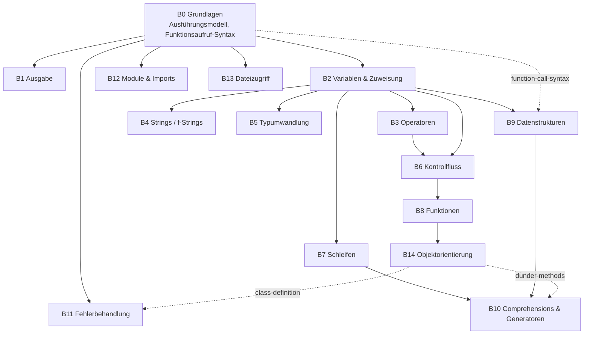
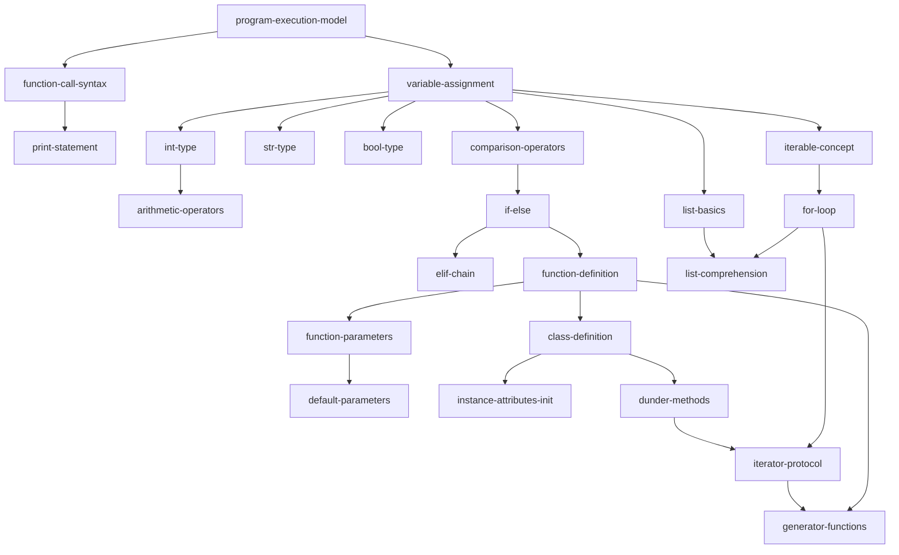

# Python-Konzept-Hierarchie (Planungsdokument)

Gleiche Methodik wie [`docs/sql-concept-hierarchy.md`](sql-concept-hierarchy.md):
kein Abbild der 10 existierenden Challenges in `pythonGrundlagen`, sondern der
Versuch, **den vollständigen Konzeptraum von Python** (im Rahmen einer
Lern-Scope-Grenze, siehe Abschnitt 7) als Tag-DAG zu erfassen. Wo sich
Python strukturell anders verhält als SQL, wird das explizit benannt statt
die SQL-Struktur blind zu kopieren — die beiden Dokumente sind bewusst
**unabhängige Graphen**, keine Unterbäume eines gemeinsamen Ober-Graphen
(Begründung: Abschnitt 8).

C# hat inzwischen ein eigenes, unabhängiges Dokument:
[`docs/csharp-concept-hierarchy.md`](csharp-concept-hierarchy.md).

## 1. Grundprinzipien

Dieselben zehn Prinzipien wie im SQL-Dokument gelten unverändert (Tag-
Granularität, DAG statt Levels, Syntax+Semantik pro Tag, Kursreihenfolge ≠
Graph, n:m zwischen Challenge und Tag, nicht jedes Tag eine Challenge,
Bündelung vs. Trennung, Zweig-Modell-Ausnahmen). Hier nur, was für Python
**anders** ist oder eine neue Illustration verdient.

### 1.1 „Variablen als Grundlage" — für Python stimmt die Prämisse fast wörtlich

Im SQL-Dokument (Abschnitt 1.4) wurde genau diese Prämisse zurückgewiesen:
SQL ist deklarativ, die Wurzel ist das relationale Modell, keine Variable.
**Für Python ist das anders** — Python ist imperativ, und `variable-
assignment` liegt tatsächlich auf **Level 1**, direkt nach dem bloßen
Ausführungsmodell. Nur `print(...)` (Challenge 01, der allererste Baustein
im Kurs) liegt noch davor — nicht weil eine Variable *ihn* voraussetzt,
sondern weil man ohne Ausgabe nicht sehen kann, was eine Variable überhaupt
bewirkt (siehe 1.3 unten: das ist Kursreihenfolge, keine echte
Abhängigkeit). Diese Diskrepanz zwischen den beiden Dokumenten ist
beabsichtigt und zeigt genau, warum eine Konzept-Hierarchie **pro Sprache**
entstehen muss, statt eine generische Liste auf beide zu pressen.

### 1.2 Die ursprüngliche Frage, diesmal wörtlich zutreffend

Die Ausgangsfrage („Sollten Funktionen mit bestimmten Parametern als auf
der Funktion aufbauend verstanden werden?") wurde für SQL beantwortet in
Bezug auf **eingebaute** Funktionen, die man *aufruft* (`date()`, `COUNT()`)
— SQL kennt in diesem Kurs keine selbst definierten Funktionen. **Python
hat beides**, und das sind zwei verschiedene Ketten:

1. **Aufruf-Konvention** (wie in SQL): `function-call-syntax` —
   `name(args)` — wird von `print`, `len()`, `int()`/`float()`/`str()`,
   `range()` und später jedem Methodenaufruf wiederverwendet (siehe 1.3
   im SQL-Dokument für die Wiederverwendungs-Regel; hier ~9 direkte
   Abhängige, ähnliche Größenordnung wie bei SQL).
2. **Definitions-Kette** (kein SQL-Äquivalent in diesem Kurs):
   `function-definition` → `function-parameters` → `default-parameters` →
   `args-kwargs`. **Das ist die wörtliche Antwort auf die Ausgangsfrage:**
   eine Funktion mit bestimmten Parametern (`def foo(x, y):`) baut direkt
   auf der Funktion ohne Parameter (`def foo():`) auf, und Default-Werte
   (`def foo(x, y=1):`) bauen wiederum auf einfachen Parametern auf — eine
   echte, geradlinige Kette, kein Sonderfall.

### 1.3 Ein weiteres Kursreihenfolge-≠-Graph-Beispiel

Challenge 01 (`print`) kommt vor Challenge 02 (Variablen) — aber
`variable-assignment` setzt `print-statement` inhaltlich nicht voraus
(man kann einer Variable etwas zuweisen, ohne je etwas auszugeben). Beide
hängen im Graphen nur von `program-execution-model` ab und sind
**Geschwister**, keine Kette — exaktes Gegenstück zum 6.1/06-Beispiel im
SQL-Dokument. Der Kurs lehrt `print` zuerst, vermutlich weil man den Effekt
einer Variable erst *sehen* kann, wenn man weiß, wie man etwas ausgibt —
ein didaktisches, kein strukturelles Argument.

### 1.4 Eine Beobachtung, die SQL nicht zeigte: kein Integrations-Leerlauf

Im SQL-Kurs gab es Challenges, die **keinen** neuen Tag einführen, sondern
nur bestehende kombinieren (Prinzip 1.6, z. B. Challenge 08). Im
10-Challenges-„Grundlagen"-Kurs für Python führt **jede einzelne** Challenge
mindestens einen neuen Tag ein — keine reine Wiederholungs-/
Integrationsübung ist dabei. Das ist keine Regel, nur eine Beobachtung: der
Python-Kurs ist (noch) so kurz, dass für Übungsschleifen ohne neuen Stoff
schlicht kein Platz war.

### 1.5 Zweig-Modell-Ausnahmen sind hier zahlreicher

Zwei spätere Zweige greifen explizit auf die Objektorientierung (B14)
zurück, obwohl sie an anderer Stelle im Graphen sitzen: `custom-exceptions`
(B11, Fehlerbehandlung) braucht `class-definition`, weil eine eigene
Exception-Klasse eine Klasse ist. `iterator-protocol` (B10, Comprehensions
& Generatoren) braucht `dunder-methods` (B14), weil das Iterator-Protokoll
über `__iter__`/`__next__` definiert ist. Das sind zwei zusätzliche
dokumentierte Ausnahmen vom vereinfachten Zweig-Überblick (Abschnitt 3) —
mehr als im SQL-Dokument, weil Pythons Objektsystem so viele andere
Bereiche unterläuft.

## 2. Was ein Tag NICHT ist

Wie im SQL-Dokument (Abschnitt 2): keine Dialekt-/Versions-Anmerkungen
(z. B. Python-2-vs-3-Unterschiede, `match`-Statement erst ab 3.10) als
eigene Knoten — das ist eine Annotation, keine Voraussetzung. Ebenso ist
„Übung/Wiederholung" kein Tag.

## 3. Zweig-Überblick

Ähnliches Bild wie bei SQL: nach einer kurzen linearen Basis (B0→B2)
fächert sich der Rest weitgehend unabhängig auf — mit zwei Rückverweisen
auf B14 (Objektorientierung), die im SQL-Graphen kein Gegenstück haben.

## 4. Tag-Katalog

Level wie im SQL-Dokument: abgeleitet, hier händisch nachvollzogen, bei
Erweiterung mechanisch neu zu berechnen.

### B0 — Grundlagen

| Tag | Label | Voraussetzungen | Level |
|---|---|---|---|
| `program-execution-model` | Programm = sequenzielle Anweisungen, Zeile für Zeile | — | 0 |
| `function-call-syntax` | `name(args)` als Ausdruck | `program-execution-model` | 1 |
| `comments` | `#`-Kommentare | `program-execution-model` | 1 |

### B1 — Ausgabe

| Tag | Label | Voraussetzungen | Level |
|---|---|---|---|
| `print-statement` | `print(...)`, String-Literale in Anführungszeichen | `function-call-syntax` | 2 |

### B2 — Variablen & Zuweisung

| Tag | Label | Voraussetzungen | Level |
|---|---|---|---|
| `variable-assignment` | `name = wert` | `program-execution-model` | 1 |
| `int-type` | Ganzzahlen (`int`) | `variable-assignment` | 2 |
| `str-type` | Text (`str`) | `variable-assignment` | 2 |
| `float-type` | Kommazahlen (`float`) | `variable-assignment` | 2 |
| `bool-type` | `True`/`False` als Werte | `variable-assignment` | 2 |
| `dynamic-typing` | Keine Typ-Deklaration nötig, Typ folgt dem Wert | `int-type`, `str-type` | 3 |
| `multiple-assignment` | `a, b = 1, 2` | `variable-assignment` | 2 |
| `variable-swap-idiom` | `a, b = b, a` ohne Hilfsvariable | `multiple-assignment` | 3 |

### B3 — Operatoren

| Tag | Label | Voraussetzungen | Level |
|---|---|---|---|
| `arithmetic-operators` | `+ - * /` (inkl. `/` liefert immer `float`) | `int-type` | 3 |
| `floor-div-modulo` | `//` (Ganzzahldivision), `%` (Rest) | `arithmetic-operators` | 4 |
| `comparison-operators` | `== != < > <= >=` | `variable-assignment` | 2 |
| `augmented-assignment` | `+= -= *= /=` | `arithmetic-operators`, `variable-assignment` | 4 |

### B4 — Strings / f-Strings

| Tag | Label | Voraussetzungen | Level |
|---|---|---|---|
| `f-strings` | `f"...{ausdruck}..."` | `str-type` | 3 |

### B5 — Typumwandlung

| Tag | Label | Voraussetzungen | Level |
|---|---|---|---|
| `type-conversion` | `int()`, `float()`, `str()` | `int-type`, `float-type`, `str-type` | 3 |
| `bool-conversion-truthiness` | `bool(x)`; welche Werte als "leer"/falsy gelten (`0`, `""`, `[]`, `None`) | `bool-type`, `type-conversion` | 4 |

### B6 — Kontrollfluss

| Tag | Label | Voraussetzungen | Level |
|---|---|---|---|
| `if-else` | `if`/`else`, Einrückung als Blockgrenze | `comparison-operators` | 3 |
| `elif-chain` | Beliebig viele `elif` zwischen `if` und `else` | `if-else` | 4 |
| `boolean-logic` | `and`/`or`/`not` | `comparison-operators`, `bool-type` | 3 |
| `truthiness-in-conditions` | `if my_list:` prüft nicht-leer, nicht nur `True`/`False` | `if-else`, `bool-conversion-truthiness` | 5 |
| `ternary-expression` | `x if bedingung else y` als Ausdruck | `if-else` | 4 |

### B7 — Schleifen

| Tag | Label | Voraussetzungen | Level |
|---|---|---|---|
| `iterable-concept` | Etwas, worüber man iterieren kann (String, Liste, Bereich) | `variable-assignment` | 2 |
| `for-loop` | `for x in ...:` | `iterable-concept` | 3 |
| `range-function` | `range(n)` als typisches Schleifen-Ziel | `for-loop`, `function-call-syntax` | 4 |
| `while-loop` | `while bedingung:` | `comparison-operators` | 3 |
| `break-continue` | Schleife vorzeitig verlassen/überspringen | `for-loop`, `while-loop` | 4 |
| `nested-loops` | Schleife in Schleife | `for-loop` | 4 |
| `loop-else` | `else`-Block nach `for`/`while` (Python-Eigenheit) | `for-loop` | 4 |

### B8 — Funktionen

| Tag | Label | Voraussetzungen | Level |
|---|---|---|---|
| `function-definition` | `def name(): ...`, Aufruf | `if-else` | 4 |
| `function-parameters` | `def name(x, y): ...` | `function-definition` | 5 |
| `default-parameters` | `def name(x, y=1): ...` | `function-parameters` | 6 |
| `return-statement` | `return wert` | `function-definition` | 5 |
| `variable-scope` | Lokal vs. global | `function-definition` | 5 |
| `args-kwargs` | `*args`, `**kwargs` | `function-parameters` | 6 |
| `lambda-expressions` | Anonyme Inline-Funktionen | `function-definition`, `return-statement` | 6 |
| `docstrings` | `"""..."""` direkt im Funktionskörper | `function-definition` | 5 |
| `recursion` | Eine Funktion ruft sich selbst auf | `function-definition`, `if-else` | 5 |
| `map-function` | `map(fn, iterable)` | `function-call-syntax`, `lambda-expressions` | 7 |
| `filter-function` | `filter(fn, iterable)` | `function-call-syntax`, `lambda-expressions` | 7 |
| `sorted-with-key` | `sorted(x, key=fn)` | `lambda-expressions` | 7 |

### B9 — Datenstrukturen

| Tag | Label | Voraussetzungen | Level |
|---|---|---|---|
| `list-basics` | `[...]`, Index-Zugriff, `len()` | `variable-assignment`, `int-type` | 3 |
| `list-slicing` | `liste[1:3]` | `list-basics` | 4 |
| `list-mutation-methods` | `.append()`, `.remove()`, `.sort()`, `.pop()` | `list-basics`, `function-call-syntax` | 4 |
| `tuple-basics` | `(...)`, unveränderlich | `multiple-assignment` | 3 |
| `dict-basics` | `{schlüssel: wert}`, Zugriff, Update | `variable-assignment`, `str-type` | 3 |
| `dict-methods` | `.get()`, `.keys()`, `.values()`, `.items()` | `dict-basics`, `function-call-syntax` | 4 |
| `set-basics` | `{...}` als Menge, Eindeutigkeit | `variable-assignment` | 2 |
| `nested-data-structures` | Liste aus Dicts, Dict aus Listen | `list-basics`, `dict-basics` | 4 |
| `membership-operator` | `in` / `not in` | `str-type` | 3 |
| `len-function` | `len(...)` über String/Liste/Dict/Set | `str-type`, `function-call-syntax` | 3 |

### B10 — Comprehensions & Generatoren

| Tag | Label | Voraussetzungen | Level |
|---|---|---|---|
| `list-comprehension` | `[x for x in ...]` | `for-loop`, `list-basics` | 4 |
| `comprehension-with-condition` | `[x for x in ... if ...]` | `list-comprehension`, `if-else` | 5 |
| `dict-comprehension` | `{k: v for ...}` | `list-comprehension`, `dict-basics` | 5 |
| `set-comprehension` | `{x for x in ...}` | `list-comprehension`, `set-basics` | 5 |
| `generator-expression` | `(x for x in ...)`, verzögerte Auswertung | `list-comprehension` | 5 |
| `iterator-protocol` | `__iter__`/`__next__` | `for-loop`, `dunder-methods` (B14) | 7 |
| `generator-functions` | `yield` | `function-definition`, `iterator-protocol` | 8 |

### B11 — Fehlerbehandlung

| Tag | Label | Voraussetzungen | Level |
|---|---|---|---|
| `runtime-errors-concept` | Code kann zur Laufzeit fehlschlagen | `program-execution-model` | 1 |
| `try-except` | `try:`/`except:` | `runtime-errors-concept` | 2 |
| `specific-exception-types` | `ValueError`, `TypeError`, `ZeroDivisionError`, `KeyError` gezielt abfangen | `try-except` | 3 |
| `finally-else-clauses` | `finally:`/`else:` bei `try` | `try-except` | 3 |
| `raise-statement` | Eigene Fehler auslösen | `try-except`, `specific-exception-types` | 4 |
| `custom-exceptions` | Eigene Exception-Klasse | `raise-statement`, `class-definition` (B14) | 6 |

### B12 — Module & Imports

| Tag | Label | Voraussetzungen | Level |
|---|---|---|---|
| `import-statement` | `import modul` | `program-execution-model` | 1 |
| `from-import` | `from modul import name` | `import-statement` | 2 |
| `standard-library-awareness` | `math`, `random`, `datetime` existieren und werden importiert | `import-statement` | 2 |
| `own-modules` | Code auf mehrere eigene Dateien aufteilen | `import-statement` | 2 |

### B13 — Dateizugriff

| Tag | Label | Voraussetzungen | Level |
|---|---|---|---|
| `file-open-read` | `open(...)`, `.read()` | `function-call-syntax`, `str-type` | 3 |
| `context-manager-with` | `with open(...) as f:` (schließt automatisch) | `file-open-read` | 4 |
| `file-write` | `.write(...)` | `file-open-read` | 4 |
| `file-modes` | `'r'`, `'w'`, `'a'`, `'r+'` | `file-open-read` | 4 |

### B14 — Objektorientierung

| Tag | Label | Voraussetzungen | Level |
|---|---|---|---|
| `class-definition` | `class Name: ...` | `function-definition` | 5 |
| `instance-attributes-init` | `__init__`, `self` | `class-definition` | 6 |
| `instance-methods` | Methoden, die `self` benutzen | `instance-attributes-init` | 7 |
| `class-vs-instance-attributes` | Attribut auf Klassen- vs. Objekt-Ebene | `instance-attributes-init` | 7 |
| `inheritance` | `class Kind(Basis): ...` | `class-definition` | 6 |
| `method-overriding` | Eine geerbte Methode neu definieren | `inheritance` | 7 |
| `dunder-methods` | `__str__`, `__eq__`, `__len__` | `class-definition` | 6 |
| `encapsulation-convention` | `_privat`/`__name`-Konvention | `instance-attributes-init` | 7 |

## 5. Detail-Graph (Kern-Zweige)

## 6. Abgleich mit der aktuellen Implementierung

*Update 2026-08-05: Challenges 11–11.5 wurden ergänzt und decken den
kompletten Zweig B7 (Schleifen) ab. Update 2026-08-08 (vormittags):
Challenges 12–12.5 ergänzt, decken 7 der 12 Tags aus B8 (Funktionen) ab.
Update 2026-08-08 (Fortsetzung): Challenges 12.6–12.8 ergänzt
(`args-kwargs`, `lambda-expressions`, `map-function`) — 10 von 12 B8-Tags
jetzt abgedeckt, nur noch `filter-function` und `sorted-with-key` offen
(beide hängen ebenfalls an `lambda-expressions`, kleine Restcharge für
später). Der Rest dieses Abschnitts ist der historische Stand vor diesen
Updates; die Bilanz am Ende ist bereits aktualisiert.*

Von den 82 Tags deckt `pythonGrundlagen` (25 Challenges) folgende ab:

**Vollständig abgedeckt:** `program-execution-model`, `function-call-syntax`
(implizit über `print`), `print-statement`, `comments`, `variable-
assignment`, `int-type`, `str-type`, `float-type`, `bool-type`, `multiple-
assignment`, `variable-swap-idiom`, `arithmetic-operators`, `floor-div-
modulo` (im Tutorial erklärt, in der Aufgabe selbst nicht zwingend
gebraucht), `comparison-operators`, `augmented-assignment`, `f-strings`,
`type-conversion`, `if-else`, `elif-chain`, `boolean-logic`, sowie **seit
2026-08-05 B7 Schleifen komplett**: `iterable-concept` (im Tutorial von
Challenge 11 eingeführt, durch die Zeichen-für-Zeichen-Iteration über einen
String direkt angewendet), `for-loop` (11), `range-function` (11.1),
`while-loop` (11.2), `break-continue` (11.3), `nested-loops` (11.4),
`loop-else` (11.5), sowie **seit 2026-08-08 fast ganz B8 Funktionen**:
`function-definition` + `return-statement` (12), `function-parameters`
(12.1), `default-parameters` (12.2), `variable-scope` (12.3),
`docstrings` (12.4), `recursion` (12.5), `args-kwargs` (12.6),
`lambda-expressions` (12.7), `map-function` (12.8) —
**37 von 82 Tags (≈ 45 %).**

**Nicht abgedeckt:** `dynamic-typing` als **eigenes** Thema (wird
durchgehend demonstriert, nie benannt — genau wie `logical-operators` im
SQL-Kurs), `bool-conversion-truthiness`, `truthiness-in-conditions`,
`ternary-expression`, die letzten beiden Tags von B8 (`filter-function`,
`sorted-with-key`), und **komplett**: B9 Datenstrukturen, B10
Comprehensions & Generatoren, B11 Fehlerbehandlung, B12 Module &
Imports, B13 Dateizugriff, B14 Objektorientierung.

**Bilanz:** 37 von 82 Tags abgedeckt (≈ 45 %) — weiterhin weniger als SQL
(55/82, ≈ 67 %), aber die Lücke ist weiter geschrumpft. Der Kursname
`pythonGrundlagen` deckt inzwischen deutlich mehr als nur die absoluten
Basics ab (Variablen, Grundrechenarten, Verzweigung, Schleifen, praktisch
ganz Funktionen inklusive *args/**kwargs, lambda und map()) — der Rest
(6 von 15 Zweigen komplett, plus Teile von B8/B2/B5/B6) ist weiterhin
unbearbeiteter Planungsraum.

## 7. Bewusst ausgeklammert

Analog zum SQL-Dokument (Abschnitt 7) bewusst nicht Teil dieser Hierarchie:

- **Nebenläufigkeit** (`threading`, `multiprocessing`, `asyncio`/`async`/
  `await`) — eigenes, fortgeschrittenes Themenfeld.
- **Metaprogrammierung** (Metaklassen, Descriptoren, `__new__`) — selten
  für Lernende relevant, die noch keine gewöhnlichen Klassen beherrschen.
- **Typannotationen/`typing`-Modul** (`List[int]`, `Protocol`, Generics) —
  optionales Werkzeug obendrauf, keine Grundvoraussetzung für Python selbst.
- **Paketierung/Distribution** (`pip`, `setup.py`, virtuelle Umgebungen) —
  Werkzeug-/Ökosystem-Thema, kein Sprachkonzept.
- **Reguläre Ausdrücke** (`re`-Modul) — eigenständiges Sprachwerkzeug
  innerhalb der Standardbibliothek, groß genug für eine eigene Hierarchie.
- **GUI/Netzwerk/Datenbank-Anbindung** — Anwendungsdomänen, keine
  Kernsprache.

## 8. Verhältnis zum SQL-Dokument (löst die dort offene Frage)

Das SQL-Dokument (Abschnitt 9) ließ offen, ob SQL- und Python-Tags einen
gemeinsamen sprachneutralen Ober-Layer teilen sollten. **Entscheidung:
nein, zwei unabhängige Graphen**, aus einem konkreten Grund: dieselbe Idee
sitzt in beiden Sprachen auf völlig unterschiedlicher Tiefe. Pythons
`for-loop` liegt auf Level 3 (braucht nur `iterable-concept`). SQLs
`recursive-cte` — die konzeptuell nächste Entsprechung von "Wiederholung"
— liegt auf Level 6 und braucht CTE, `UNION ALL` und `WHERE` zusammen. Ein
gemeinsamer Wurzelknoten „Wiederholung", der beide Kinder korrekt
einordnen soll, müsste auf einem Level liegen, das für die SQL-Seite die
tatsächliche Tiefe verschleiert. Die Verbindung bleibt eine **Prosa-
Referenz, keine Graph-Kante** — passend dazu erklärt Challenge 05 des
Python-Kurses `if`/`elif`/`else` bereits explizit über SQLs `CASE WHEN`
("dieselbe Idee — nur als Programmablauf statt als Teil einer Abfrage").
Konkrete Paare, die sich lohnen würden, in beiden Dokumenten als Fußnote zu
verlinken, sobald beide fertig sind: `case-expression` (SQL) ↔ `if-else`
(Python), `recursive-cte` (SQL) ↔ `for-loop`/`recursion` (Python),
`recursive-cte-traversal` (SQL) ↔ `recursion` über verschachtelte
Datenstrukturen (Python).

Bemerkenswerter Zufall, mechanisch nachgerechnet (siehe Abschnitt 9): beide
Graphen erreichen ihre größte Tiefe bei genau **Level 8** —
`recursive-cte-traversal` in SQL, `generator-functions` in Python. In
beiden Sprachen ist das fortgeschrittenste Konzept eine Variante von
"Wiederholung, die sich selbst mit verändertem Zustand aufruft" — ein
weiteres Indiz dafür, dass die Idee dieselbe ist, auch wenn die Graphen
unabhängig bleiben.

## 9. Offene Fragen

- Gleiche Frage wie im SQL-Dokument: Levels mechanisch berechnen, sobald
  der Graph als Daten statt nur als Markdown-Tabelle existiert.
- **`function-definition` hängt hier von `if-else` ab** (wiederverwendet
  das Einrückungs-/Block-Konzept) — das ist eine bewusste Modellierungs-
  Entscheidung, kein Python-Zwang: man könnte Funktionen ohne vorheriges
  `if` einführen. Sie spiegelt aber, wie der Block-Begriff im Kurs zuerst
  auftaucht (Challenge 05), und vermeidet, "Einrückung bedeutet
  Blockzugehörigkeit" zweimal unabhängig zu erklären.
- **`iterable-concept` und `runtime-errors-concept`** sind wie
  `relational-model` in SQL reine Tutorial-Konzepte ohne eigene Challenge
  — beim Umsetzen in Code (siehe SQL-Dokument, Abschnitt 8, zur
  `conceptTags`-Frage) bräuchten solche Knoten eine andere Kennzeichnung
  als "kein Content", nicht "fehlender Content".
