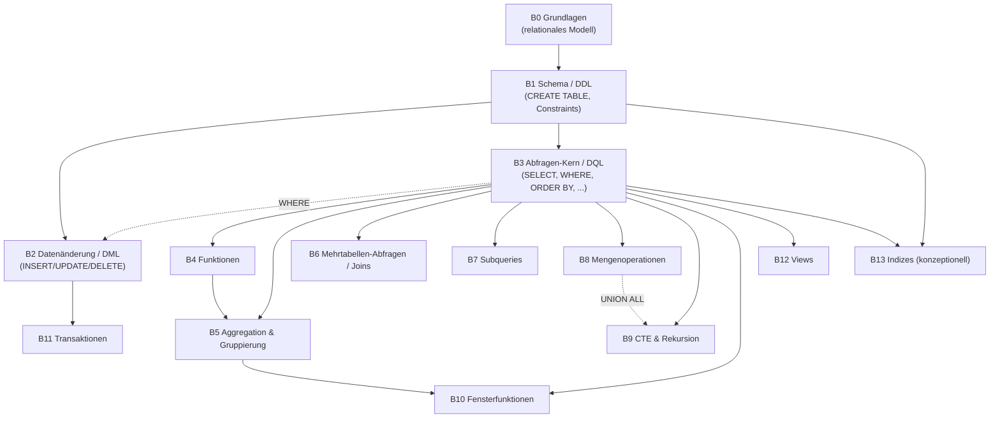
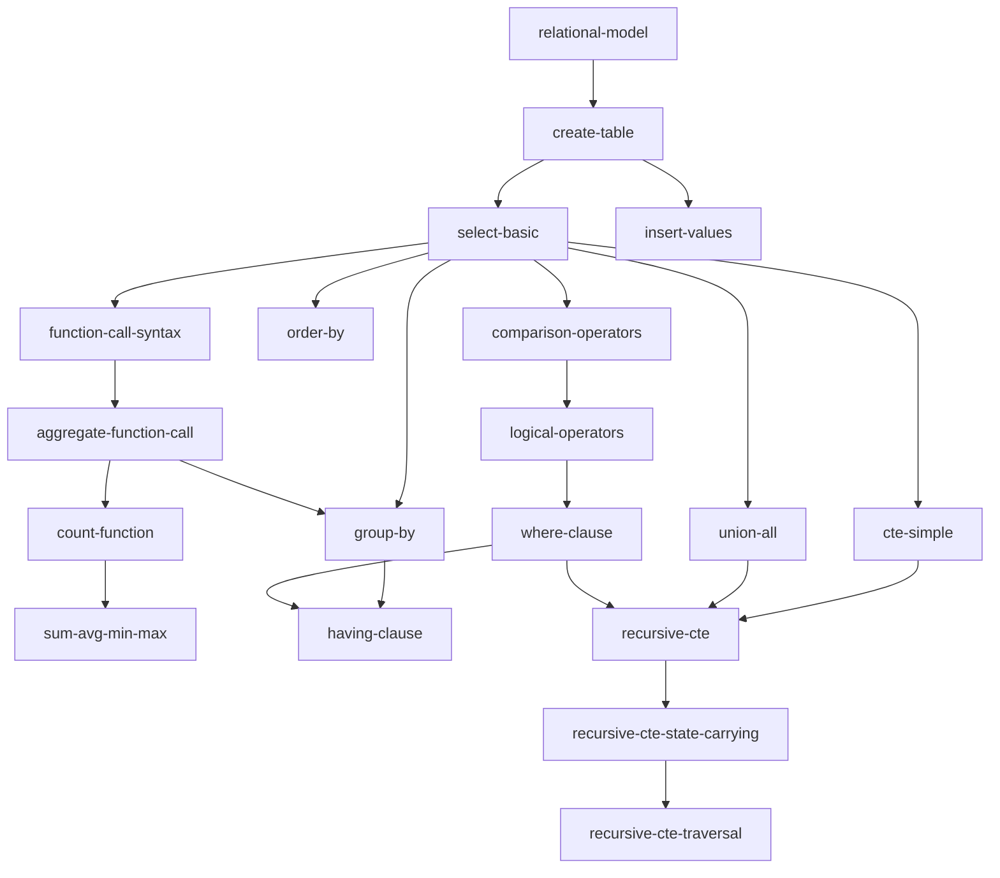

# SQL-Konzept-Hierarchie (Planungsdokument)

Dies ist kein Abbild der 41 existierenden Challenges in `sqlLernenTool` —
es ist der Versuch, **den vollständigen Konzeptraum von SQL** hierarchisch
zu erfassen: jedes Konzept als Tag, mit expliziten Abhängigkeiten zu den
Konzepten, ohne die es unverständlich bleibt. Die aktuelle Implementierung
deckt einen Teil davon ab (siehe Abschnitt 6) — der Rest ist Planungsgrundlage
für künftige Challenges.

Python ([`docs/python-concept-hierarchy.md`](python-concept-hierarchy.md))
und C# ([`docs/csharp-concept-hierarchy.md`](csharp-concept-hierarchy.md))
haben inzwischen eigene, unabhängige Dokumente (siehe Abschnitt 8/9).

## 1. Grundprinzipien

Diese Entscheidungen sind nicht willkürlich — jede beantwortet eine konkrete
Frage, die beim Entwurf zwingend auftaucht.

### 1.1 Ein Tag ist das kleinste Konzept, das man entweder kennt oder nicht

Nicht jede Syntax-Variante verdient einen eigenen Tag. Faustregel: **ein
neuer Tag ist gerechtfertigt, wenn eine andere Art von Verständnis nötig
ist — nicht schon, wenn nur ein neues Argument dazukommt.**

- `date('now')` und `date('now', '+1 day')` sind **derselbe Tag**
  (`date-functions`) — der zweite Aufruf braucht kein neues Konzept, nur
  mehr Übung mit demselben.
- `COUNT`, `SUM`, `AVG`, `MIN`, `MAX` könnten 5 Tags sein. Die bestehende
  Implementierung bündelt sie bewusst so, wie sie tatsächlich unterrichtet
  werden: `COUNT` einzeln (Challenge 8.1, weil es untrennbar mit `GROUP BY`
  eingeführt wird), `SUM/AVG/MIN/MAX` als ein Paket (Challenge 11.3, Titel:
  „**Weitere** Aggregatfunktionen"). Die Granularität eines Tags sollte sich
  an dem orientieren, **was ein Lehrplan tatsächlich als einen Schritt
  behandelt** — nicht an einer theoretisch maximalen Zerlegung.

### 1.2 Abhängigkeiten sind ein DAG, keine Levels

Die naheliegende erste Idee — jedem Konzept eine feste Stufe 0, 1, 2, 3...
zuzuweisen — ist **falsch**, sobald man sie an echten Beispielen prüft:

- `HAVING` braucht `GROUP BY` **und** `WHERE`. Beide "landen" ungefähr auf
  ähnlicher Tiefe, aber `HAVING` braucht nicht "alles auf Stufe 3" — nur
  genau diese zwei, nicht z. B. `JOIN`, das auf vergleichbarer Tiefe liegt.
- `JOIN...ON` und `GROUP BY` hängen beide (indirekt) nur von `WHERE`/`SELECT`
  ab, aber **nicht voneinander**. Sie in eine gemeinsame "Stufe 4" zu
  zwingen würde eine Reihenfolge zwischen ihnen erfinden, die nicht existiert.

Die richtige Struktur ist ein **DAG** (gerichteter, azyklischer Graph):
jedes Tag listet seine **direkten** Voraussetzungen (nicht die transitive
Hülle). Ein "Level" ist keine Eingabe, sondern eine **abgeleitete**
Eigenschaft — der längste Pfad von einer Wurzel bis zu diesem Tag. Das ist
mechanisch berechenbar (`level(x) = 1 + max(level(prereq) für alle direkten
prereqs))`, driftet also nie auseinander von der eigentlichen
Abhängigkeitsliste, wie es bei von Hand gepflegten Levelnummern passieren
würde. Der Graph (Abschnitt 5) ist die Quelle der Wahrheit; Levels in den
Tabellen sind zur Orientierung mitgerechnet, nicht separat gepflegt.

### 1.3 Funktionen: die gestellte Frage im Detail

**„Sollten Funktionen mit bestimmten Parametern als auf der Funktion
aufbauend verstanden werden?"** — Ja, aber in drei Ebenen, nicht zwei:

1. **Syntax-Ebene** (`function-call-syntax`): `name(args)` ist ein Ausdruck,
   der überall stehen darf, wo ein Wert erwartet wird. Das lernt man genau
   einmal.
2. **Kategorie-Ebene**: `scalar-function-call` (eine Zeile rein, ein Wert
   raus — `date()`, `round()`) vs. `aggregate-function-call` (viele Zeilen
   rein, ein Wert raus — `COUNT`, `SUM`). Das ist ein **echter begrifflicher
   Sprung**, kein Implementierungsdetail — wer nur skalare Funktionen kennt,
   versteht nicht automatisch, warum `SUM(betrag)` ohne `GROUP BY` etwas
   anderes tut als mit.
3. **Konkrete Funktion**: `date-functions`, `random-function`,
   `count-function`, `sum-avg-min-max`, `cast-conversion` — jede hängt von
   ihrer Kategorie ab, nicht direkt von der Syntax-Ebene.

Wichtiger Gegen-Fall, der die Regel schärft: **`%` (Modulo) und `||`
(String-Verkettung) sind in SQL Operatoren, keine Funktionen.** Sie hängen
direkt von den Grund-Ausdrucksregeln ab (`arithmetic-expressions` bzw.
`select-basic`), nicht von `function-call-syntax` — auch wenn sie sich
"wie eine Fähigkeit neben Funktionen" anfühlen. Wer naiv "alles mit
Klammern drumrum ist eine Funktion" annimmt, tackt hier falsch ab.

Und: nicht jeder Parameter-Unterschied verdient einen Tag (siehe 1.1) —
`CAST(x AS INTEGER)` und `CAST(x AS TEXT)` sind derselbe Tag
(`cast-conversion`), weil beide dieselbe Art Verständnis brauchen
(Typumwandlung), nicht zwei verschiedene.

### 1.4 Kritik an der Prämisse „Variablen als Grundlage"

Das Beispiel aus der Anfrage — ohne Variablen sind andere Konzepte
unverständlich — stimmt für imperative Sprachen (Python, C#), **aber nicht
für SQL**. SQL ist deklarativ; es gibt keine klassische Variablenzuweisung
auf oberster Ebene. Die tatsächliche Wurzel ist das **relationale Modell**
(eine Tabelle ist eine Menge von Zeilen mit benannten, typisierten
Spalten) — nicht eine Variable. Das nächste, was SQL zu einer "Variable"
hat, ist ein benannter Zwischenschritt (`WITH name AS (...)`), und der
liegt bereits recht tief im Graphen (Abschnitt 5, Zweig B9), nicht an der
Wurzel. Diese Diskrepanz ist genau der Grund, warum dieses Dokument SQL-
spezifisch beginnt statt eine generische "Programmierkonzepte"-Liste zu
kopieren.

### 1.5 Lehrreihenfolge ≠ Abhängigkeitsgraph

Ein konkretes Gegenbeispiel aus der bestehenden Implementierung:
Challenge 6.1 ("Zwei Tabellen sinnvoll filtern") kommt in der Kursnummerierung
**nach** Challenge 06 ("CROSS JOIN"), aber Challenge 6.1 braucht CROSS JOIN
inhaltlich gar nicht — sie baut direkt auf 5.2 (impliziter Komma-Join) und
`WHERE` auf. 06 und 6.1 sind im Abhängigkeitsgraphen **Geschwister**, keine
Kette, auch wenn der Kurs sie linear hintereinander unterrichtet (vermutlich
aus didaktischen/narrativen Gründen). Der Graph in diesem Dokument bildet
ab, was **notwendig** ist; die tatsächliche Kursreihenfolge ist eine gültige
*topologische Sortierung* dieses Graphen, aber nicht die einzige mögliche
und nicht mit ihm identisch. Ein nützlicher Nebeneffekt: der Graph lässt
sich benutzen, um eine geplante Kursreihenfolge automatisch zu prüfen (kommt
jede Challenge erst, nachdem alle ihre Tag-Voraussetzungen bereits
eingeführt wurden?).

### 1.6 Challenge ↔ Tag ist n:m, nicht 1:1

Manche Challenges führen **kein** neues Tag ein, sondern sind reine
Integrations-/Anwendungsübungen bestehender Tags — z. B. Challenge 08
("Realistisch aussehende Fake-Daten") kombiniert nur `string-concat-operator`
+ `case-expression` + `random-function` + `recursive-cte`, ohne ein neues
Konzept zu lehren. Das ist kein Mangel im Tag-Modell, sondern **erwünscht**:
Wiederholung/Kombination bereits gelernter Konzepte ist pädagogisch wertvoll
und braucht keinen eigenen Tag, um zu "zählen". Andere Challenges (z. B. 01)
führen dagegen mehrere Tags gleichzeitig ein.

### 1.7 Nicht jedes Tag ist eine Challenge

`relational-model` (Tabelle = Menge von Zeilen) ist die Wurzel des ganzen
Graphen, aber kein sinnvoller eigenständiger "Task" — das ist Kontext, den
ein Tutorial-Text vermittelt, bevor die erste Challenge überhaupt startet.
Ein Tag-Graph für Lerninhalte muss zwischen **prüfbaren Fähigkeiten**
(bekommt eine Challenge) und **notwendigem Verständnis ohne eigene Übung**
(bekommt höchstens einen Tutorial-Absatz) unterscheiden.

### 1.8 Bündelung in der Praxis vs. Trennung in der Theorie — ein bewusster Konflikt

Die bestehende Implementierung führt `COUNT` untrennbar zusammen mit
`GROUP BY` ein (Challenge 8.1). Für eine vollständige Konzept-Landkarte ist
das **zu grob**: Fensterfunktionen (Zweig B10) brauchen Aggregatfunktionen
**ohne** `GROUP BY` (`SUM(x) OVER (...)` kollabiert keine Zeilen). Deshalb
trennt dieses Dokument `aggregate-function-call` (die Funktionen selbst)
und `group-by` (das Zusammenfassen von Zeilen) in zwei Tags, wobei
`group-by` von `aggregate-function-call` abhängt. Ein Kurs **darf** trotzdem
beide in einer Challenge bündeln (siehe 1.6) — das Tag-Modell muss aber die
feinere, korrekte Trennung vorhalten, damit spätere Inhalte (Fensterfunktionen)
nicht nachträglich alles umbauen müssen.

### 1.9 Eine dokumentierte Ausnahme vom Zweig-Modell

Der Zweig-Überblick (Abschnitt 3) suggeriert, dass Datenänderung (B2) nur
von Schema (B1) abhängt. Das stimmt nur für `INSERT ... VALUES`. Tatsächlich
brauchen `UPDATE`/`DELETE` `WHERE` (B3), und `INSERT ... SELECT` sowie
`UPSERT` brauchen zusätzlich `SELECT` bzw. Constraint-Wissen. Ebenso
brauchen `CHECK`-Constraints (B1) einen Vergleichsoperator aus B3. Diese
Querverbindungen sind im Tag-Katalog (Abschnitt 4) exakt vermerkt — der
vereinfachte Zweig-Überblick ist nur eine Lesehilfe, keine vollständige
Wahrheit.

### 1.10 Syntax ist Teil jedes Tags — nicht implizit vorausgesetzt

Berechtigter Einwand: „Ein Konzept verstehen" verlangt zuerst, seine Syntax
überhaupt zu erkennen und korrekt zu schreiben — reicht ein Tag wie
`where-clause` nicht eigentlich für zwei getrennte Fähigkeiten (Syntax
tippen können vs. verstehen, was es tut)?

**Die Antwort ist ja, aber nicht als 82 zusätzliche Knoten.** Jeder Tag in
diesem Dokument bündelt per Definition beides — „ein Tag kennen" heißt
immer *sowohl* die Syntax korrekt schreiben/erkennen *als auch* erklären
können, was sie bewirkt und wann man sie einsetzt. Ein Lernender, der
`WHERE status = 'offen'` zuverlässig hinschreibt, aber nicht sagen kann,
warum genau diese Zeilen übrig bleiben, hat `where-clause` **nicht**
abgeschlossen — beide Hälften gehören untrennbar zum selben Tag.

Ein eigener Syntax-Tag lohnt sich nur, wenn die Syntax **über mehrere
Konzepte hinweg identisch wiederverwendet wird** — dann ist sie tatsächlich
ein eigenständiges, wiederverwendbares Stück Wissen, kein Duplikat. Genau
dafür existiert `function-call-syntax` bereits (Abschnitt 1.3): `name(args)`
ist die *gleiche* Schreibweise für `date()`, `RANDOM()`, `COUNT()` und
`CAST()` — sie einmal zu lernen und neunmal wiederzuverwenden ist etwas
anderes, als sie neunmal neu zu erklären. Geprüfte Gegenprobe: Die
`AS`-Syntax für Spalten- und Tabellen-Alias ist zwar auch identisch, taucht
aber nur an zwei Stellen auf — zu wenig Wiederverwendung, um einen eigenen
Knoten zu rechtfertigen; sie bleibt Teil von `column-alias` bzw.
`table-alias`. Und die "boolescher Ausdruck"-Syntax, die `WHERE`, `CASE`,
`JOIN...ON`, `CHECK` und `HAVING` alle brauchen, ist bereits als eigener
Baustein vorhanden — nicht als "Syntax-Tag", sondern als die Kombination
`comparison-operators` + `logical-operators`, von der alle fünf abhängen.

Wichtiger, ehrlicher Hinweis: Der Abstand zwischen "Syntax nachtippen
können" und "wirklich verstehen" ist **nicht bei jedem Tag gleich groß**.
Bei `column-alias` ist er praktisch null — wer die Syntax schreibt, versteht
sie auch. Bei `case-expression`, `recursive-cte` und allem in B7
(Subqueries) ist er real und pädagogisch relevant: ein Lernender kann das
`WITH RECURSIVE`-Muster aus Challenge 03 kopieren, ohne zu begreifen, dass
er gerade eine Schleife baut — genau das beschreibt Challenge 3.2/3.3
implizit, indem sie denselben Mechanismus mit einem anderen Zustand
(Datum statt Zähler) wiederholt, um die Musterkopie von echtem Verständnis
zu unterscheiden. Für eine spätere Umsetzung als Code wäre das ein
Kandidat für ein optionales zweites Signal pro Challenge (z. B. "kann die
Syntax reproduzieren" vs. "kann sie auf ein neues Problem übertragen"),
nicht für einen zusätzlichen Graph-Knoten.

## 2. Was ein Tag NICHT ist

- **Dialekt-Unterschiede** (SQLite vs. Postgres/MySQL) sind keine
  Voraussetzung für irgendetwas — sie sind eine Annotation auf einem
  bereits verstandenen Tag (die bestehende `extra.pg`-Notiz pro Challenge
  ist genau dafür da). Sie tauchen im Graphen nicht als Knoten auf.
- **"Übung/Wiederholung"** ist kein Tag (siehe 1.6).

## 3. Zweig-Überblick

Nach einer kurzen, zwingend linearen Basis (B0→B1→B3) fächert sich SQL in
weitgehend unabhängige Zweige auf, die nur noch von der Basis abhängen,
nicht voneinander:

Das ist die zentrale strukturelle Erkenntnis: **B4–B13 sind zueinander
weitgehend Geschwister**, nicht Glieder einer einzigen Kette. Ein Lernender
könnte nach B3 z. B. zuerst Joins (B6), dann Fensterfunktionen (B10) *oder*
zuerst Transaktionen (B11), dann Joins lernen — beide Reihenfolgen sind
gültig, weil keine der beiden die andere voraussetzt.

## 4. Tag-Katalog

Format: `tag-id — Label | direkte Voraussetzungen | Level (abgeleitet)`.
Level wird wie in 1.2 beschrieben berechnet, hier händisch nachvollzogen
für Referenzzwecke — bei Erweiterung des Graphen sollte das mechanisch
geschehen, nicht erneut von Hand.

### B0 — Grundlagen

| Tag | Label | Voraussetzungen | Level |
|---|---|---|---|
| `relational-model` | Relationales Modell (Tabelle = Zeilenmenge) | — | 0 |

### B1 — Schema / DDL

| Tag | Label | Voraussetzungen | Level |
|---|---|---|---|
| `create-table` | `CREATE TABLE`, Spalten & Datentypen | `relational-model` | 1 |
| `not-null-constraint` | `NOT NULL` | `create-table` | 2 |
| `unique-constraint` | `UNIQUE` | `create-table` | 2 |
| `primary-key-constraint` | `PRIMARY KEY` | `not-null-constraint`, `unique-constraint` | 3 |
| `default-value-constraint` | `DEFAULT` | `create-table` | 2 |
| `foreign-key-constraint` | `FOREIGN KEY ... REFERENCES` | `primary-key-constraint` | 4 |
| `check-constraint` | `CHECK (...)` | `create-table`, `comparison-operators` (B3) | 4 |
| `alter-table` | `ALTER TABLE` (Spalte hinzufügen/umbenennen) | `create-table` | 2 |
| `drop-table` | `DROP TABLE` | `create-table` | 2 |
| `create-index` | `CREATE INDEX` | `create-table` | 2 |

### B2 — Datenänderung / DML

| Tag | Label | Voraussetzungen | Level |
|---|---|---|---|
| `insert-values` | `INSERT INTO ... VALUES` | `create-table` | 2 |
| `insert-select` | `INSERT INTO ... SELECT` | `insert-values`, `select-basic` (B3) | 3 |
| `update-statement` | `UPDATE ... SET ... WHERE` | `where-clause` (B3) | 6 |
| `delete-statement` | `DELETE FROM ... WHERE` | `where-clause` (B3) | 6 |
| `upsert-on-conflict` | `INSERT ... ON CONFLICT DO UPDATE` | `insert-values`, `unique-constraint` | 3 |

### B3 — Abfragen-Kern / DQL

| Tag | Label | Voraussetzungen | Level |
|---|---|---|---|
| `select-basic` | `SELECT ... FROM` (auch `SELECT *`) | `create-table` | 2 |
| `arithmetic-expressions` | `+ - * /` in Ausdrücken | `select-basic` | 3 |
| `comparison-operators` | `= <> < > <= >=` | `select-basic` | 3 |
| `logical-operators` | `AND OR NOT` | `comparison-operators` | 4 |
| `where-clause` | `WHERE`-Filterung | `logical-operators` | 5 |
| `order-by` | `ORDER BY`, `ASC`/`DESC` | `select-basic` | 3 |
| `limit-offset` | `LIMIT`/`OFFSET` | `order-by` | 4 |
| `column-alias` | Spalten-Alias (`AS`) | `select-basic` | 3 |
| `table-alias` | Tabellen-Alias (`AS`) | `select-basic` | 3 |
| `distinct-keyword` | `DISTINCT` | `select-basic` | 3 |
| `like-pattern-matching` | `LIKE`, `%`/`_`-Platzhalter | `where-clause` | 6 |
| `between-in-shorthand` | `BETWEEN`, `IN (Liste)` | `where-clause` | 6 |
| `null-checks` | `IS NULL` / `IS NOT NULL` | `where-clause` | 6 |
| `coalesce-nullif` | `COALESCE`, `NULLIF` | `null-checks`, `scalar-function-call` (B4) | 7 |
| `case-expression` | `CASE WHEN ... THEN ... END` | `select-basic`, `comparison-operators` | 4 |
| `string-concat-operator` | `\|\|` (Verkettung, **Operator, keine Funktion**) | `select-basic` | 3 |
| `modulo-operator` | `%` (**Operator, keine Funktion**) | `arithmetic-expressions` | 4 |

### B4 — Funktionen

| Tag | Label | Voraussetzungen | Level |
|---|---|---|---|
| `function-call-syntax` | `name(args)` als Ausdruck | `select-basic` (B3) | 3 |
| `scalar-function-call` | Kategorie: 1 Zeile rein → 1 Wert raus | `function-call-syntax` | 4 |
| `aggregate-function-call` | Kategorie: viele Zeilen rein → 1 Wert raus | `function-call-syntax` | 4 |
| `date-functions` | `date()`, `datetime()`, `strftime()` | `scalar-function-call` | 5 |
| `math-functions` | `round()`, `abs()` | `scalar-function-call` | 5 |
| `string-functions` | `substr()`, `upper()`, `lower()`, `trim()`, `replace()` | `scalar-function-call` | 5 |
| `cast-conversion` | `CAST(x AS type)` | `scalar-function-call` | 5 |
| `random-function` | `RANDOM()` | `scalar-function-call` | 5 |
| `random-integer-range` | `RANDOM()` + `%` auf einen Bereich begrenzt | `random-function`, `modulo-operator` | 6 |
| `count-function` | `COUNT(*)`/`COUNT(spalte)` | `aggregate-function-call` | 5 |
| `sum-avg-min-max` | `SUM`, `AVG`, `MIN`, `MAX` | `aggregate-function-call`, `count-function` | 6 |

### B5 — Aggregation & Gruppierung

| Tag | Label | Voraussetzungen | Level |
|---|---|---|---|
| `group-by` | `GROUP BY` | `select-basic` (B3), `aggregate-function-call` (B4) | 5 |
| `having-clause` | `HAVING` (Filter nach Aggregation) | `group-by`, `where-clause` (B3) | 6 |

### B6 — Mehrtabellen-Abfragen / Joins

| Tag | Label | Voraussetzungen | Level |
|---|---|---|---|
| `multi-table-cross-comma` | `SELECT * FROM a, b` (impliziter Cross Join) | `select-basic` (B3) | 3 |
| `cross-join-keyword` | `CROSS JOIN` (explizite Schreibweise) | `multi-table-cross-comma` | 4 |
| `inner-join-on` | `JOIN ... ON` | `multi-table-cross-comma`, `comparison-operators` (B3), `table-alias` (B3) | 4 |
| `self-join` | Join einer Tabelle mit sich selbst | `inner-join-on` | 5 |
| `left-join` | `LEFT JOIN` (unpassende Zeilen behalten) | `inner-join-on` | 5 |
| `right-join` | `RIGHT JOIN` | `left-join` | 6 |
| `full-outer-join` | `FULL OUTER JOIN` | `left-join`, `right-join` | 7 |
| `multi-table-join-nway` | 3+ Tabellen verketten | `inner-join-on` | 5 |

### B7 — Subqueries

| Tag | Label | Voraussetzungen | Level |
|---|---|---|---|
| `scalar-subquery` | Subquery, die genau 1 Wert liefert | `select-basic` (B3) | 3 |
| `subquery-in-select` | Skalare Subquery als berechnete Spalte | `scalar-subquery` | 4 |
| `derived-table-subquery` | Subquery in `FROM` (inline "Tabelle aus Query") | `select-basic` (B3) | 3 |
| `subquery-set` | Subquery, die mehrere Zeilen/eine Spalte liefert | `select-basic` (B3) | 3 |
| `subquery-in-where-in` | `WHERE x IN (SELECT ...)` | `subquery-set`, `between-in-shorthand` (B3) | 7 |
| `exists-subquery` | `EXISTS` / `NOT EXISTS` | `subquery-set`, `where-clause` (B3) | 6 |
| `correlated-subquery` | Subquery, die auf die äußere Zeile verweist | `subquery-set`, `where-clause` (B3) | 6 |

### B8 — Mengenoperationen

| Tag | Label | Voraussetzungen | Level |
|---|---|---|---|
| `union-all` | `UNION ALL` | `select-basic` (B3) | 3 |
| `union-distinct` | `UNION` (mit implizitem Dedup) | `union-all`, `distinct-keyword` (B3) | 4 |
| `intersect` | `INTERSECT` | `union-all` | 4 |
| `except-minus` | `EXCEPT` | `union-all` | 4 |

### B9 — CTE & Rekursion

| Tag | Label | Voraussetzungen | Level |
|---|---|---|---|
| `cte-simple` | `WITH name AS (...)` | `select-basic` (B3) | 3 |
| `multiple-ctes-chained` | Mehrere `WITH`-Blöcke hintereinander | `cte-simple` | 4 |
| `recursive-cte` | `WITH RECURSIVE` (Anker + rekursiver Teil) | `cte-simple`, `union-all` (B8), `where-clause` (B3) | 6 |
| `recursive-cte-state-carrying` | Rekursion trägt einen sich verändernden Zustand (nicht nur einen Zähler) | `recursive-cte` | 7 |
| `recursive-cte-traversal` | Rekursion über echte hierarchische Daten (z. B. Kategoriebaum, Organigramm) statt reiner Zahlen-/Datumsreihen | `recursive-cte-state-carrying` | 8 |

### B10 — Fensterfunktionen

| Tag | Label | Voraussetzungen | Level |
|---|---|---|---|
| `window-function-basic` | `... OVER (...)` | `aggregate-function-call` (B4), `order-by` (B3) | 5 |
| `partition-by` | `PARTITION BY` innerhalb `OVER` | `window-function-basic` | 6 |
| `ranking-functions` | `ROW_NUMBER`, `RANK`, `DENSE_RANK` | `window-function-basic` | 6 |
| `offset-functions` | `LAG`, `LEAD` | `window-function-basic`, `order-by` (B3) | 6 |
| `running-aggregates` | Laufende Summen/Mittelwerte (`SUM(...) OVER (...)`) | `window-function-basic`, `aggregate-function-call` (B4) | 6 |

### B11 — Transaktionen

| Tag | Label | Voraussetzungen | Level |
|---|---|---|---|
| `transaction-basic` | `BEGIN` / `COMMIT` | `insert-values` (B2) | 3 |
| `rollback` | `ROLLBACK` | `transaction-basic` | 4 |
| `savepoint` | `SAVEPOINT` (Teil-Rücksetzung) | `transaction-basic` | 4 |

### B12 — Views

| Tag | Label | Voraussetzungen | Level |
|---|---|---|---|
| `create-view` | `CREATE VIEW` | `select-basic` (B3) | 3 |
| `updatable-view` | Durch eine View hindurch `INSERT`/`UPDATE` — **bewusst ausgeklammert, siehe Abschnitt 7** | `create-view`, `update-statement` (B2) | 7 |

### B13 — Indizes (konzeptionell)

`create-index` selbst gehört strukturell zu B1 (es ist Schema-Definition,
keine Abfrage) und ist dort bereits gelistet — B13 baut auf ihm auf, ist
aber die Frage *warum/wann* ein Index nützt, nicht *wie* man ihn anlegt.

| Tag | Label | Voraussetzungen | Level |
|---|---|---|---|
| `index-performance-concept` | Warum ein Index eine `WHERE`/`JOIN`-Spalte beschleunigt | `create-index` (B1), `where-clause` (B3) | 6 |
| `explain-query-plan` | `EXPLAIN QUERY PLAN` lesen | `index-performance-concept` | 7 |

## 5. Detail-Graph (Kern-Zweige)

Der vollständige Graph mit allen 82 Tags ist als ein einziges Diagramm
nicht mehr lesbar. Hier der Kern (B0–B3, B5, B9) exemplarisch — die übrigen
Zweige folgen demselben Muster aus Abschnitt 4.

## 6. Abgleich mit der aktuellen Implementierung

*Update 2026-08-05: Challenges 14–14.5 wurden ergänzt und decken den
kompletten Zweig B7 (Subqueries) ab — die vorherige größte Einzellücke.
Update 2026-08-08: Challenges 16–16.2 ergänzt und decken den kompletten
Zweig B11 (Transaktionen) ab — der erste der drei bis dahin komplett
offenen kleinen Zweige (B11/B12/B13). Update 2026-08-08 (stündliche
Routine, Fortsetzung): Challenge 17 ergänzt und deckt `create-view` ab,
den ersten der beiden B12-Tags. Der zweite Tag (`updatable-view`) wurde
vor dem Schreiben empirisch geprüft (nicht angenommen) — siehe Abschnitt
7 — und stellte sich als über dieses Curriculum hinweg unerreichbar
heraus, weil SQLite dafür `INSTEAD OF`-Trigger voraussetzt, die bereits
zuvor bewusst ausgeklammert wurden. `updatable-view` ist damit als
dauerhafte Scope-Ausnahme dokumentiert (analog zu `own-modules` im
Python-Dokument), nicht als offene Aufgabe. B12 gilt damit als
abgeschlossen. Update 2026-08-08 (stündliche Routine, Fortsetzung):
Challenges 18–18.2 ergänzt und decken B13 (Indizes) komplett ab —
zusätzlich auch `create-index` selbst (strukturell B1, aber bis dahin
ebenfalls ungenutzt), womit der letzte komplett offene SQL-Zweig
geschlossen ist. Update 2026-08-09 (stündliche Routine, Fortsetzung):
Challenges 19–19.1 ergänzt und decken B9 (CTE & Rekursion) komplett ab —
die vom Dokument selbst als zweitgrößte Lücke benannten Tags
`multiple-ctes-chained` und `recursive-cte-traversal`. 19 verkettet zwei
CTEs (Abteilungsdurchschnitt → Mitarbeiter darüber), 19.1 ist die erste
Challenge im Kurs, die `WITH RECURSIVE` über echte hierarchische Daten
traversiert (ein Organigramm) statt nur Zahlen-/Datumsreihen zu erzeugen
— inklusive einer mitgezählten Rekursionstiefe als Sicherheitsnetz gegen
zyklische Daten, da die App selbst eine `WITH RECURSIVE` ohne `WHERE`
oder `LIMIT` im rekursiven Teil vorab blockiert (`findUnboundedRecursion`)
und ein reiner Join-basierter Abbruch dafür nicht erkannt wird. Der Rest
dieses Abschnitts ist der historische Stand vor diesen Updates; die
Bilanz am Ende ist bereits aktualisiert.*

Von den 82 Tags in diesem Dokument deckt `sqlLernenTool` (61 Challenges)
folgende **nicht** ab — das ist die eigentliche Planungs-Nutzlast dieses
Dokuments:

**B1 Schema:** `default-value-constraint`, `check-constraint`,
`foreign-key-constraint` (der Kurs verknüpft Tabellen nur über zufällig
passende IDs, deklariert nie einen echten `FOREIGN KEY`), `alter-table`,
`drop-table`.

**B2 DML:** `upsert-on-conflict`.

**B3 DQL:** `logical-operators` als **eigenes** Thema (wird implizit
verwendet, nie explizit erklärt), `coalesce-nullif`.

**B4 Funktionen:** `math-functions` (`round()`, `abs()`), `cast-conversion`,
und `string-functions` (`substr()`, `upper()`, `lower()`, `trim()`,
`replace()` — der Kurs nutzt nur den `||`-Operator, keine dieser Funktionen
taucht in einer der 41 Challenges auf).

**B6 Joins:** `self-join`, `right-join`, `full-outer-join`.

**B7 Subqueries:** ~~komplett nicht abgedeckt~~ — **seit 2026-08-05
vollständig abgedeckt** durch Challenges 14 (`scalar-subquery`), 14.1
(`subquery-in-select`), 14.2 (`derived-table-subquery`), 14.3
(`subquery-set` + `subquery-in-where-in`), 14.4 (`exists-subquery`) und
14.5 (`correlated-subquery`). War zuvor die größte inhaltliche Lücke —
der Kurs löste bis dahin alles über CTEs/Joins, nie über eine Subquery in
`WHERE`/`FROM`/`SELECT`.

**B8 Mengenoperationen:** `union-distinct`, `intersect`, `except-minus`
(nur `UNION ALL` wird unterrichtet).

**B9 CTE:** ~~`multiple-ctes-chained`, und vor allem
`recursive-cte-traversal` — die vorhandenen Challenges nutzen Rekursion
ausschließlich zur **Erzeugung** von Zahlen-/Datumsreihen, nie zur
**Traversierung** existierender hierarchischer Daten (z. B. "finde alle
Mitarbeiter unter einem Manager"). Das ist die zweitgrößte Lücke — beide
sind SQL-Kernkompetenzen, die im Kurs bisher fehlen.~~ — **seit
2026-08-09 vollständig abgedeckt** durch Challenge 19 (`multiple-ctes-chained`:
zwei verkettete CTEs, Abteilungsdurchschnitt gefolgt von den Mitarbeitern
darüber) und 19.1 (`recursive-cte-traversal`: die erste Rekursion im Kurs
über eine echte hierarchische Tabelle statt einer erzeugten Zahlenreihe —
ein Organigramm, mit mitgezählter Tiefe als Abbruchbedingung).

**B10 Fensterfunktionen:** ~~komplett nicht abgedeckt~~ — **seit
2026-08-07 vollständig abgedeckt** durch Challenges 15 (`window-function-basic`),
15.1 (`partition-by`), 15.2 (`ranking-functions`), 15.3 (`offset-functions`)
und 15.4 (`running-aggregates`).

**B11 Transaktionen:** ~~komplett nicht abgedeckt~~ — **seit 2026-08-08
vollständig abgedeckt** durch Challenges 16 (`transaction-basic`), 16.1
(`rollback`) und 16.2 (`savepoint`) — alle drei als durchgehendes
Überweisungs-Szenario (Anna/Ben/Clara) erzählt: 16 zeigt BEGIN/COMMIT,
16.1 ROLLBACK als vollständiges Verwerfen, 16.2 SAVEPOINT/ROLLBACK TO als
gezieltes Teil-Verwerfen innerhalb einer laufenden Transaktion.

**B12 Views:** ~~komplett nicht abgedeckt~~ — **seit 2026-08-08
abgeschlossen** durch Challenge 17 (`create-view`); der zweite Tag
(`updatable-view`) ist keine offene Lücke mehr, sondern eine dauerhafte
Scope-Ausnahme (siehe Abschnitt 7).

**B13 Indizes:** ~~komplett nicht abgedeckt~~ — **seit 2026-08-08
vollständig abgedeckt** durch Challenges 18 (`create-index`, strukturell
B1, aber hier zum ersten Mal tatsächlich unterrichtet), 18.1
(`index-performance-concept`) und 18.2 (`explain-query-plan`) — ein
durchgehendes Szenario: 18 legt einen Index an, 18.1 zeigt anhand einer
zweiten Tabelle, dass der Index gezielt auf die `WHERE`-Spalte zeigen
muss, damit `EXPLAIN QUERY PLAN` von `SCAN` auf `SEARCH ... USING INDEX`
wechselt, 18.2 lässt den Query-Plan selbst schreiben und lesen.

**Gut abgedeckt:** B0–B1-Basics (jetzt inklusive `create-index`), DML-Kern
(ohne Upsert), DQL-Kern fast vollständig, Aggregation/Gruppierung, Joins
bis `LEFT JOIN`, **B7 Subqueries (seit 2026-08-05 vollständig)**,
**B9 CTE & Rekursion (seit 2026-08-09 vollständig, jetzt inklusive
Traversierung echter Hierarchien)**, **B10 Fensterfunktionen (seit
2026-08-07 vollständig)**, **B11 Transaktionen (seit 2026-08-08
vollständig)**, **B12 Views (seit 2026-08-08 abgeschlossen, `create-view`
abgedeckt, `updatable-view` als dauerhafte Ausnahme)**, **B13 Indizes
(seit 2026-08-08 vollständig)**.

**Bilanz:** 64 von 82 Tags sind heute durch mindestens eine Challenge
abgedeckt (≈ 78 %). Kein Zweig ist mehr zu 100 % Lücke — die einzige
verbleibende Struktur-Lücke ist `updatable-view`, das als dauerhafte
Scope-Ausnahme dokumentiert ist (nicht als offene Aufgabe).

## 7. Bewusst ausgeklammert

Diese Themen existieren in echtem SQL, sind aber für ein Lern-Tool (kein
DBA-Training) bewusst nicht Teil dieser Hierarchie:

- **Rechteverwaltung** (`GRANT`/`REVOKE`, Benutzer) — Administrations-,
  kein Abfrage-Thema.
- **Trigger, gespeicherte Prozeduren** — stark dialektabhängig (SQLite
  unterstützt nur einfache Trigger, kein PL/pgSQL-Äquivalent), und eher
  fortgeschrittenes Anwendungsdesign als SQL-Grundverständnis.
- **`updatable-view` (Tag aus B12)** — empirisch geprüft (2026-08-08, via
  `node:sqlite` 3.51.2, also keine veraltete Version): SQLite verweigert
  `UPDATE`/`INSERT`/`DELETE` durch eine normale View hindurch mit dem
  echten Fehler `cannot modify <view> because it is a view`, **außer** die
  View hat eigene `INSTEAD OF`-Trigger — und Trigger stehen bereits oben
  auf dieser Liste als bewusst ausgeklammert. Anders als bei
  `own-modules` im Python-Dokument ist das hier kein Sandbox-Limit,
  sondern eine direkte Folge einer anderen bereits getroffenen
  Scope-Entscheidung dieses Dokuments: Der Tag bliebe nur erreichbar,
  wenn zuerst Trigger ins Curriculum aufgenommen würden. Der Tag bleibt
  im Graph stehen (er beschreibt ein echtes SQL-Konzept), zählt aber wie
  die anderen Einträge dieser Liste **nicht** als planbare Lücke in
  Abschnitt 6.
- **JSON-Funktionen, Volltextsuche, Geodaten** — dialekt-/erweiterungsspezifisch.
- **Materialized Views** — Postgres-spezifisch, kein SQLite-Konzept.
- **Replikation, Partitionierung, Backup** — Betriebs-, kein Sprachthema.

## 8. Offene Fragen

- **Levels mechanisch berechnen statt Hand-Pflege**, sobald der Graph als
  Daten (nicht nur als Markdown-Tabelle) existiert — sonst drohen die
  Level-Zahlen in Abschnitt 4 mit der Zeit zu driften.
- **Soll dieses Dokument Code werden** (z. B. ein `conceptTags`-Feld an
  `BaseChallenge`, analog zu `prereqNums`)? Aktuell ist es reine Planung.
  Falls ja: `prereqNums` (Daten-Setup-Reihenfolge) und die hier beschriebenen
  Konzept-Tags sind **zwei verschiedene Achsen** — eine Challenge kann
  Daten von Challenge X wiederverwenden, ohne deren Konzept vorauszusetzen,
  und umgekehrt. Beide Felder sollten getrennt bleiben, nicht
  zusammengelegt werden.
- **`right-join`/`full-outer-join` und SQLite:** erst seit 3.39 (2022)
  unterstützt — falls die im Browser geladene sql.js-Version älter ist,
  wäre das ein technisches Hindernis, keins der Konzept-Modellierung.

## 9. Ausblick: Python, C#

**Update:** Die hier aufgeworfene Frage ist inzwischen entschieden —
[`docs/python-concept-hierarchy.md`](python-concept-hierarchy.md) existiert
und begründet in Abschnitt 8, warum SQL und Python **unabhängige Graphen**
bleiben (kein gemeinsamer sprachneutraler Ober-Layer): `recursive-cte`
(SQL) und `for-loop`/`recursion` (Python) sind zwar dieselbe Grundidee
("Wiederholung"), sitzen aber auf völlig unterschiedlicher Tiefe im
jeweiligen Graphen (Level 6 vs. Level 3) — ein gemeinsamer Wurzelknoten
hätte diese Tiefe für eine der beiden Seiten verfälscht. Die Verbindung
bleibt eine Prosa-Referenz zwischen den Dokumenten, keine Graph-Kante.

**Zweites Update:** [`docs/csharp-concept-hierarchy.md`](csharp-concept-hierarchy.md)
existiert jetzt ebenfalls — drittes unabhängiges Dokument, gleiche
Entscheidung. Bemerkenswertester Fund dort (Abschnitt 8): `linq-query-syntax`
(C#, `from x in coll where ... select ...`) ist syntaktisch fast identisch
mit genau den beiden hier dokumentierten SQL-Tags `select-statement`/
`where-clause` — liegt aber in C# auf Level 7, fast am tiefsten Punkt des
gesamten C#-Graphen, während `select-statement`/`where-clause` hier zu den
flachsten Tags gehören. Dieselbe Oberflächen-Syntax an entgegengesetzten
Enden der jeweiligen Tiefe — eine noch schärfere Illustration desselben
Prinzips als das SQL/Python-Paar oben.
C# bleibt weiterhin offen.
