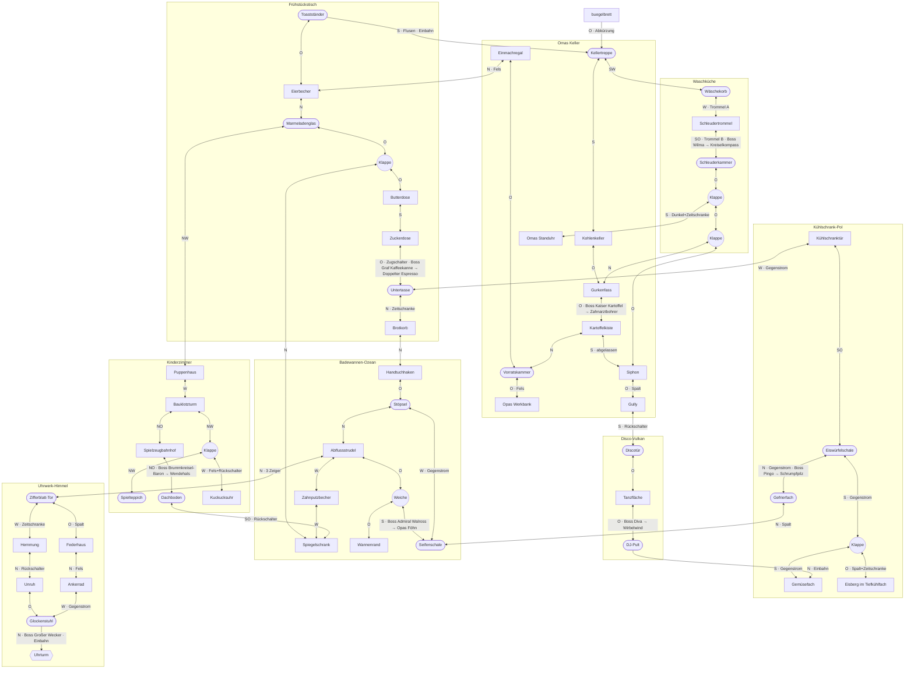

# Wendehals – Weltdesign Runde 2: Richtungssystem, Progression, Weltgraph

> **Hinweis 05.10.2026 – Referenz, nicht mehr bindend wo widersprochen.** Verbindlich ist
> [`PROTOTYPEN.md`](PROTOTYPEN.md). **Setting offen:** Das Haus (Frühstückstisch, Bad, Keller, … und der
> Querschnitt des Hauses) ist für das echte Spiel gestrichen; Graph, Regeln und IDs in `welt.json` bleiben
> Arbeitsdaten. **Richtungen:** Bildschirm = Fenster auf einem Grundriss von oben (Robins Skizze), kein
> vertikales Fliegen, kein Zoom-out, keine gedrehten 45°-Etappen (Kap. 2.2 überholt), 180° = nur
> Scroll-Umkehr. Kapitel 5–6 (Tempo, Beispiel-Etappen) sind Beispiele – Level werden mehrfach neu gebaut.

> Stand: 4. Oktober 2026 · Rolle: Game Designer · Grundlage: Code-Stand v0.2 (`src/data/world.js`, `worldgraph.js`, `solver.js`, `levelgen.js`, `docs/DESIGN.md`) und Rechercheergebnisse des Welt-Rhythmus-Analysten.
> Alle Zahlen zu Minuten, Anteilen, Längen und Kosten in diesem Dokument sind **Designentscheidungen** (Zielwerte), keine Messwerte. Werte aus der Recherche sind mit [b] (belegt) bzw. [g] (geschätzt) markiert.
> Maschinenlesbare Fassung: `docs/welt.json` (gleiche IDs). Prüfer: `tools/pruefe-welt.mjs` (Löser, siehe Kapitel 7), unabhängige Gegenprüfung: `tools/gegenpruefung.py`. Umsetzungsplan: `docs/PLAN-v0.3.md`.

## 0. Kurzfassung

- **8 Blickrichtungen** (45°-Raster). Sie zerfallen in zwei Klassen: **Kreuz** (O, S, W, N) und **Andreaskreuz** (die Diagonalen). **Paritätsregel:** 90° und 180° bleiben in der Klasse, nur eine 45°-Drehung wechselt sie. Damit wird „Richtung“ zu einer echten Schlüssel-Ressource: Wer keine 45° kann, kommt an keine Eck-Klappe.
- **Drei Etappentypen:** waagerecht (wie bisher), senkrecht (wie bisher, herausgezoomt) und neu **diagonal** (kurze, enge „Rinnen“ ohne Wrap, Bild um 45° gedreht).
- **Fünf Drehstufen** statt einer frühen Allzweck-Drehung: Stationen (Start) → *Drehwurm* (90° an Kreiseln, 14 %) → *Schiefe Wasserwaage* (45° an Kreiseln, 32 %, Breitenwirkung) → *Wendehals* (180° überall, ~40 %) → *Kreiselkompass* (frei in jeder Arena, ~55 %) → *Wirbelwind* (immer und überall, auch an Seitenklappen mitten in Etappen, 67 %, Breitenwirkung).
- **Drehzahl** als Ladung: Freie Drehungen kosten 1 Segment je 45°; 4 Segmente = eine Wende. Nachladen über geflogene Strecke. Stationen sind kostenlos. Das setzt Robins Vorgabe „einmal benutzen, weiterfliegen, wieder benutzen“ um.
- **Drehen mitten in der Etappe** geht nur an **Weichen** (Kreisel) und **Seitenklappen**: Die Etappe hält dort an (Halt-Zone, ein Mini-Arena-Raum) und verzweigt. 180° (Wendehals) geht überall. So bleibt das Arena/Etappen-Modell erhalten, und der Löser kann alles prüfen.
- **Welt:** 8 Gebiete (5 bestehende, 3 neue: Kinderzimmer, Kühlschrank, Waschküche), **71 Arenen**, **86 Etappen** plus **11 Abzweig-Etappen** an 11 Stationen mitten in Etappen (zusammen 97). Ziel-Spielzeit **4 h** Erstdurchgang, **5,5 h** für 100 %.
- **Öffnungsrhythmus:** 1 Ziel → 1 → 1 (Keller als Beinahe-Gefangenschaft) → **3 parallele Ziele** (Kinderzimmer, Kühlschrank, Waschküche) → 1 (Disco hinter drei Schlössern) → **3 parallele Ziele** (drei Uhrzeiger) → 1 (Uhrwerk-Finale).
- **Zustandswechsel:** Das Bad wird abgelassen (neue Wege, optionaler Boss). Die Schleudertrommel ist eine drehbare Arena (umschaltbar). **3 Sequence Breaks**, **3 optionale Bosse**.

---

## 1. Ausgangslage und was sich ändert

| Heute (v0.2) | Problem | Neu |
|---|---|---|
| 4 Richtungen (`E,S,W,N` = 0–3) | Robin will 45° | 8 Richtungen (`E,SE,S,SW,W,NW,N,NE` = 0–7, Index ×2 gegenüber heute) |
| Drehwurm nach dem ersten Boss: 90° in jeder Arena | Welt öffnet sich viel zu früh | Drehwurm wirkt nur an Kreiseln; „überall in Arenen“ erst bei ~55 % |
| Wendehals 180° ohne Begrenzung | Wende-Spam, kein Rhythmus | Drehzahl-Ladung (4 Segmente, Laden über Strecke) |
| Welt 25 Arenen / 32 Etappen, fast linear | zu wenig Abzweigungen | 71 Arenen / 97 Etappen, Schleifen, Abkürzungen, Teaser, Zustandswechsel |
| Gegnerwellen gleichmäßig aus dem Generator | Tempo undynamisch | Tempo-Zonen mit Keyframes, Halt-Zonen an jeder Station (Kapitel 5) |
| Drehen nur in Arenen | keine Stationen im Level | Weichen und Seitenklappen mitten in Etappen (`midStations`) |

Was bleibt: Arenen mit Ausgängen nur in Blickrichtung, Etappen als 1D-Level (`a` = Flugrichtung, `c` = Querachse), Spiegelung beim Rückflug, Rückholstationen, Rückzug vor Wänden, Löser mit Zustand (Arena, Blick, Items), weiche/harte Hindernisse, Power-Leiste getrennt von permanenten Fähigkeiten.

---

## 2. Richtungssystem (A)

### 2.1 Acht Richtungen und zwei Klassen

| Index | 0 | 1 | 2 | 3 | 4 | 5 | 6 | 7 |
|---|---|---|---|---|---|---|---|---|
| Richtung | O (E) | SO (SE) | S | SW | W | NW | N | NO (NE) |
| Klasse | + | × | + | × | + | × | + | × |

- Drehen um +1 = 45° im Uhrzeigersinn. `turn(h, k) = (h + k) & 7`, `opposite(h) = (h + 4) & 7`, Bildwinkel `h · 45°`.
- **Paritätsregel (Designentscheidung):** Ringe für 90°, Drehwurm, Wendehals und Ratschen ändern die Klasse nie. Nur der Schrägring und die Wasserwaage (45°) wechseln zwischen + und ×. Die Regel ist leicht zu lernen („ein Kreuz, ein schiefes Kreuz“), sie macht 45° zum härtesten Schloss der ersten Spielhälfte, und der Löser bekommt sie gratis, weil die Blickrichtung Teil des Zustands ist.
- **Arenen:** Ausgänge der +-Klasse liegen wie bisher in den Wänden (mehrere pro Seite möglich). Ausgänge der ×-Klasse liegen **in den Ecken** als rautenförmige **Eck-Klappen**, höchstens eine pro Ecke.

### 2.2 Etappentypen

| Typ | Richtungen | Querachse | Zoom | Terrain | Gefühl |
|---|---|---|---|---|---|
| Waagerecht | O, W | 288 (Boden + Decke) oder 544 (Wrap) | 1,0 | Boden/Decke als Profil + Set-Pieces | Parodius-Klassik, Hauptanteil (~45 %) |
| Senkrecht | N, S | 960 | 0,5625 | Schachtwände | Fallen und Steigen, Strömungen, Sog (~30 %) |
| **Diagonal** | NO, SO, SW, NW | **320, nie Wrap** | **0,68** (Prototyp-Wert) | Rinnenwände, 45°-Schrägen, Treppen | „Rutschbahn“: enger, schneller, mehr Terrain, weniger Gegner (~25 %) |

**So fühlt sich eine Diagonal-Etappe an (Designentscheidung):**
- Das lokale Koordinatensystem bleibt (`a`, `c`); der Renderer dreht die Szene nur um `h · 45°` statt `h · 90°`. Das Kachelraster dreht sich mit, darum erscheinen **alle Wände als saubere 45°-Linien**. Das ist der deutlichste optische Unterschied und hilft der Orientierung: schräge Wände = schräge Etappe.
- **Sichtweite:** Auf 480×270 reicht die Diagonale nur bis zum oberen bzw. unteren Rand. Darum wird um 0,68 herausgezoomt und die Kamera so versetzt, dass etwa 70 % der sichtbaren Strecke vor dem Dackel liegen. Ziel: wie bei vertikalen Etappen **480 Einheiten Vorschau** in Flugrichtung. Das wird mit dem bestehenden Reaktionszeit-Test abgesichert (Abstand zur Vorderkante ÷ Gegnertempo gleich in allen 8 Richtungen).
- **Kein Wrap:** Ein endloser Querschnitt wäre diagonal unlesbar. Diagonal-Etappen sind immer Rinnen mit festen, tödlichen Wänden (Treppenwangen, Murmelbahn-Banden, Wäscheleinen).
- **Kürzer:** 1.400–2.200 Einheiten (35–55 s), damit die ungewohnte Lage nicht ermüdet.
- **Gegner** kommen aus der vorderen Ecke und aus Wandgeschützen an den Seiten; Kugeln fliegen in Weltkoordinaten (keine Sonderregel). Keine Set-Pieces, die nur waagerecht lesbar sind (Text, Uhrziffern).
- **Hintergrund-Muster** (Tischdecke, Fliesen, Tapete) laufen sichtbar diagonal mit; das trägt das Tempogefühl.
- **Eingabe** bleibt bildschirmbezogen (Stick oben = Bild oben), wie heute über `screenToLocalVec`, nur mit 45°-Rotation.
- **Dackel-Sprite:** zeigt mit der Nase in Flugrichtung, um 45° gekippt („Schräglage“). Das ist ein Traum, das darf albern aussehen.

### 2.3 Dreh-Stationen

Zwei Familien: **Mechanische Stationen** wirken für jeden (Grundversorgung, Lernen, Schutz vor Steckenbleiben). **Kreisel** sind Anker, an denen erst die Fähigkeiten wirken – das ist Robins „erstmal nur an bestimmten Stationen“.

| Station (`type`) | Wirkung | Fähigkeit nötig | Wo | Signal (Form · Farbe · Ton) |
|---|---|---|---|---|
| Drehring (`ring90`) | Durchfliegen: 90° im Umlaufsinn | nein | Arena | oranger Ring, außen Pfeil rechts, innen links · „Klong“ |
| Schrägring (`ring45`) | Durchfliegen: 45° im Umlaufsinn | nein | Arena (selten, früh) | blauer Ring mit doppeltem Rand, geknickte Pfeile · höheres „Kling“ |
| Wender (`wender180`) | Hineinfliegen: 180° | nein | Sackgassen | U-Rohr mit Pfeil · „Plopp“ |
| Kompassrose (`kompass`) | jede Richtung der eigenen Klasse frei wählen; mit Wasserwaage alle 8 | nein (45° mit Wasserwaage) | jede Speicherstation | Bodenmosaik mit 8 Spitzen; die 4 Zwischenspitzen sind grau, bis man die Wasserwaage hat (Teaser) |
| **Kreisel** (`kreisel`) | Drehen per Fähigkeit: Drehwurm ±90°, Wasserwaage ±45°; beliebig oft, kostenlos, füllt die Drehzahl auf | ja | Arena **und** Weiche mitten in der Etappe | grüner Brummkreisel auf einem Nagel; dreht träge, mit passender Fähigkeit schnell und summend; ohne Fähigkeit schubst er nur zurück (180°, mechanisch), damit man nie festsitzt |
| Ratsche (`ratsche`) | Durchfliegen: 90°, **nur im Uhrzeigersinn** | nein | Uhrwerk-Himmel | Messing-Zahnkranz mit Sperrklinke · „Klick“ |
| **Seitenklappe** (`klappe`) | Abzweig mitten in der Etappe ohne Kreisel | Wirbelwind | Etappe | Wandklappe mit Wirbel-Symbol; grau und verriegelt vor dem Wirbelwind, wird nach Erstkontakt auf der Karte markiert |
| Stille Arena (`null`) | keine Station; immer mit Rückholstation als Notausgang | Kreiselkompass/Wirbelwind (oder Wende) | Arena (selten, spät: Gully, Unruh) | kahler Boden, Hall-Ton beim Hereinfliegen |

**Weiche** = Kreisel mitten in einer Etappe. Die Etappe hält dort an (Halt-Zone, Kapitel 5); man sieht die Abzweig-Klappe in der Wand und den Kreisel in der Mitte.

### 2.4 Drehstufen: von „nur an Stationen“ zu „immer und überall“

| Stufe | Fähigkeit | Anteil · Minute | Wo wirkt sie | Winkel | Kosten |
|---|---|---|---|---|---|
| 0 | – (Start) | 0 % | mechanische Stationen (Ring, Schrägring, Wender, Kompassrose in der eigenen Klasse) | je Station | frei |
| 1 | **Drehwurm** | 14 % · 33 min | an Kreiseln in Arenen und an Weichen in Etappen | ±90° | frei |
| 2 | **Schiefe Wasserwaage** | 32 % · 77 min | an Kreiseln und Kompassrosen | ±45° (Klassenwechsel) | frei |
| 3 | **Wendehals** | ~40 % · ~96 min* | überall: Arena und mitten in der Etappe | 180° | 4 Segmente |
| 4 | **Kreiselkompass** | ~55 % · ~132 min* | überall **in Arenen**, auch ohne Station | 45°/90°/135°/180° | 1 Segment je 45° |
| 5 | **Wirbelwind** | 67 % · 161 min | **immer und überall**: zusätzlich an Seitenklappen in Etappen; Drehzahl lädt doppelt so schnell; Pirouette (Kampf) | alle | 1 Segment je 45° |

\* Stufe 3 und 4 liegen in der Phase mit drei parallelen Zielen; welche zuerst kommt, entscheidet der Spieler.

**Warum diese Reihenfolge:** Der alte Drehwurm (überall 90° nach dem ersten Boss) hat die Welt sofort geöffnet. Jetzt öffnet jede Stufe eine klar abgegrenzte Menge Schlösser: Stufe 1 die Weichen, Stufe 2 alle Eck-Klappen (die größte Öffnung der ersten Hälfte), Stufe 3 Rückschalter, Stufe 4 stille Arenen, Stufe 5 alle Seitenklappen (die zweite große Öffnung). Mit dem Wirbelwind ist der Spieler wirklich „immer und überall“ frei – genau dann, wenn die Zeiger-Jagd quer durch die alte Welt beginnt.

### 2.5 Drehzahl: die Ladung

Robins frühere Vorgabe: Die Richtungsfähigkeit kann man einmal benutzen, dann muss man weiterfliegen, dann wieder.

**Regel (Designentscheidung):**
- Anzeige: ein Halbkreis aus **4 Segmenten** um das Dackel-Symbol im HUD (je Segment 45°, zusammen 180°).
- **Kosten** freier Drehungen (ohne Station): 45° = 1, 90° = 2, 135° = 3, 180° = 4 Segmente. Eine Wende leert die Grundladung komplett.
- **Laden über Strecke:**
  - In Etappen 1 Segment je 120 Einheiten Scrollstrecke. Bei Grundtempo (42 E/s) ist die Ladung nach 480 Einheiten (eine Bildschirmlänge, ~11 s) wieder voll, mit Espresso nach ~6 s.
  - In Arenen und Halt-Zonen 1 Segment je 80 px Flugweg (~0,5 s), also praktisch sofort.
  - Wirbelwind halbiert beide Strecken.
- **Stationen kosten nichts** und füllen die Drehzahl voll (Kreisel = Tankstelle).
- **Brummkreisel** (optionale Erweiterung, 4 Stück): je +1 Segment, maximal 8 (zwei Wenden hintereinander).
- **Leer:** Kopfschütteln, kurzes Schwindel-Wackeln, „?“ (Show don't tell).

**Warum Strecke statt Zeit:** Sie belohnt Vorwärtsfliegen, verhindert Wende-Spam in Etappen, passt zum Espresso (Synergie) und macht Halt-Zonen-Rätsel kontrollierbar. In einem Halt lädt man nur durch Herumfliegen, und Kreisel stehen dort, wo mehr als eine Wende nötig ist.

**Steuerung (Vorschlag):**
- B halten und mit dem Stick die Zielrichtung zeigen (8-Wege, mit Rastung und Vorschau-Pfeil), B loslassen = Drehung. Geht die Drehung nicht, gibt es Kopfschütteln.
- Y = Wende (Wendehals), wie heute.
- Tastatur: K + Pfeile, L/Q für die Wende.
- Die Drehanimation friert die Simulation ein wie heute `turnAnim`: 0,4 s in Arenen, 0,8 s in Etappen. Das bleibt fair.

### 2.6 Drehen mitten in der Etappe: Entscheidung

| Variante | Umsetzbarkeit im Modell | Entscheidung |
|---|---|---|
| a) Die Etappe knickt frei ab, wo man dreht | bräuchte 2D-Level-Generierung und Welt neben jeder Etappe; Löser unmöglich | nein |
| b) Man verlässt die Etappe seitlich, wo man will | jede Etappe bräuchte einen definierten Raum daneben | nein |
| c) 180°: Etappe rückwärts fliegen | existiert (`Level.reverse()`) | **ja (Wendehals)** |
| d) 45°/90° an **definierten Abzweigen** (Weiche/Seitenklappe) | Station = Knoten, Abzweig = eigene Etappe; Level bleibt 1D je Teilstück | **ja** |

**Umsetzung:**
- Jede `midStation` teilt eine Kante in Teilstrecken.
- Am Stationspunkt sitzt ein **Weichenraum**: eine Mini-Arena (ein Bildschirm, Thema der Etappe, Kamera steht) mit bis zu drei offenen Ausgängen: weiter, zurück und den Abzweig. Technisch ist das die bestehende `Arena`-Klasse mit dem Grafikstil der Etappe und einem nahtlosen Übergang ohne Titelkarte.
- Der Abzweig ist eine normale Etappe vom Stationspunkt zum Ziel (`branchTo`, `branchHeading`).
- „Überall“ heißt: Die Fähigkeit funktioniert an jedem Punkt. Die Welt bietet an 11 Stellen einen Abzweig. Ohne Abzweig bewirkt eine 45°/90°-Eingabe mitten in der Etappe nichts außer Kopfschütteln.

### 2.7 Richtung als Weltfaktor: Palette

| # | Mechanik (`gateType`/Regel) | Regel | Lesbarkeit / Signal | Gelöst durch | Softlock-Risiko → Gegenmaßnahme |
|---|---|---|---|---|---|
| 1 | **Strömung / Sog** (`gegenstrom` + `current`) | Mit der Strömung: Sog-Zone (1,5× Tempo, frei). Dagegen: hart gesperrt. | Partikelstrom, Blasen bzw. Kälteschwaden, Pfeile im Hintergrund, Rauschen | Föhn (gegen den Strom) | wirkt wie eine Einbahn → nur dort, wo die Strömung zu einem Hub führt; Löser prüft |
| 2 | **Rückschlagklappe** (`oneWay`, `opensAfterPass`) | Einbahn; manche Klappen bleiben nach dem ersten Durchflug offen (Abkürzung) | Klappe mit rotem Pfeil, von hinten Scharnier sichtbar | Durchfliegen von vorn | Einbahn in eine Sackgasse → Rückholstation; Klappen-Zustand im Löser |
| 3 | **Eck-Klappe** (Diagonal-Ausgang) | nur in ×-Blickrichtung offen | Rautenklappe mit blauem 45°-Winkel | Schrägring, Wasserwaage | in der ×-Klasse gefangen → Regel R2 (Kapitel 8), Löser kennt die Klasse |
| 4 | **Kompassschloss** (`kompassschloss`) | Tür öffnet nach einer Folge von Blickrichtungen mit Diagonalen (z. B. N → NO → O), in der Halt-Zone davor | Tür mit Zifferring, drei Symbole leuchten der Reihe nach | Wasserwaage | Drehzahl reicht nicht → in jeder Schloss-Halt-Zone steht ein Kreisel (kostenlos) |
| 5 | **Rückschalter** (`rueckschalter`, nur vorwärts) | Das Ende der Etappe öffnet ein Schalter, der hinter einer Blende sitzt: Man fliegt vorbei, wendet, schießt, wendet zurück. Gegner-Variante: Schild vorn, Schwachstelle hinten. | Schalter leuchtet auf der Rückseite, Blende vorn mit Kreuz | Wendehals | Halt ohne Ausweg → Rückzug immer möglich; Halt ≥ 2 Bildschirme Flugweg zum Nachladen (R10) |
| 6 | **Drehbare Arena** (`trommel_a`/`trommel_b`, Hebel `toggles`) | Die Schleudertrommel dreht sich um 45°: In Stellung A liegen die Öffnungen an O/N/W, in Stellung B an NO/SO/SW/NW. Man selbst dreht nicht mit. | Trommel-Optik, Wäschesymbol über jeder Öffnung, Hebel | Rollleine (Hebel) | Ausgang „verschwindet“ → Hebel in der Trommel **und** im Hub, Zustand bleibt, Flag im Löser |
| 7 | **Stille Arena** (`station null`) | keine Station | kahler Raum, Hall | Kreiselkompass, Wirbelwind | nach Ankunft keine Drehung → jede stille Arena hat eine Rückholstation (R11) |
| 8 | **Ratschen-Gebiet** | Stationen und freie Drehungen im Uhrwerk-Himmel nur im Uhrzeigersinn | Sperrklinken-Klick, Zahnkranz | – (kostet nur Zeit und Drehzahl) | graphisch neutral |
| 9 | **Eiszapfen** (`eiszapfen`, nur rückwärts) | Abwärts ein Stachelfeld, aufwärts harmlos | Zapfen zeigen nach unten | Quietscheentenhaut, Können | weich → nie Pflicht (R12) |
| 10 | **Seitenklappe** (`klappe`) | Abzweig mitten in der Etappe ohne Kreisel | Wirbel-Symbol, grau vor dem Wirbelwind | Wirbelwind | Abzweig-Ende ohne Rückweg → Abzweige enden in Arena mit Ausweg oder in Sackgasse mit Wender |
| 11 | **Gebiets-Wind** | Kühlschrank: Kaltluft fällt, Nord-Etappen Gegenwind, Süd-Etappen Sog. Disco: Lava-Aufwind. | Schwaden, Funken | Föhn | wie 1 |
| 12 | **Spiegel-Etappe** | Spiegelwände werfen eigene Schüsse zurück; Schalter oft nur im Spiegelbild hinter dir sichtbar | Spiegelglanz, verdoppelte Gegner | Wendehals (Variante von 5) | wie 5 |
| 13 | **Zustandswechsel Gebiet** (`abgelassen`) | Nach Wilmas Abpumpen ist das Bad leer: trockene Wege am Wannenboden, Hydra im Abfluss | Wasserlinie an den Wänden, Pfützen | Ereignis `STOEPSEL` | nur additiv → keine Sackgasse |

---

## 3. Fähigkeiten und Progression (B)

### 3.1 Permanente Fähigkeiten

**Grundsatz (Parodius-Lektion):** Die Power-Leiste (Tempo, Rakete, Doppel, Laser, Begleiter, Schild) bleibt temporär und geht beim Tod verloren. Permanente Fähigkeiten öffnen Wege. Die einzigen permanenten Dinge mit Einfluss auf die Power-Leiste sind Sparstrumpf und Bonbongläser.

| ID | Name | Pflicht | Kampf | Bewegung | Rätsel | öffnet |
|---|---|---|---|---|---|---|
| `ROLLLEINE` | **Omas Flexileine** (neu) | ja | Lasso: zieht Bonbons und kleine Gegner heran, schleudert sie als Geschoss | **Anker:** an Leinenpflöcken (alle ~600 E in jeder Etappe) festmachen, dann hält die Kamera, solange man will. Das ist Robins „anhalten, wo es passt“. | Zugschalter, Tischdecke ziehen, Schleuderhebel der Trommel | `zugschalter`, Trommel-Hebel |
| `ESPRESSO` | Doppelter Espresso (bestehend) | ja | Turbo-Ausweichen | Scrolltempo ×2 halten, Cruise-Komfort | Zeitschranken; lädt Drehzahl doppelt so schnell | `zeitschranke` |
| `DREHWURM` | Drehwurm (umgebaut) | ja | Bosse mit Kreisel in der Arena (Walross von der Seite) | **Drehstufe 1:** 90° an Kreiseln | Weichen | Weichen (`kreisel`) |
| `FOEHN` | **Opas Föhn** (neu) | ja | Pusten im Nahbereich wirft Kugeln zurück, schiebt Gegner | gegen Strömungen und Gegenwind fliegen | Flusen und Krümel wegblasen, Windräder drehen | `gegenstrom`, `flusen` |
| `LAMPE` | Opas Grubenlampe (bestehend) | nein (weich) | Gartenzwerge erstarren im Lichtkegel | Dunkelzonen | Lichtsensoren | `dunkel` |
| `BOHRER` | Zahnarztbohrer (bestehend) | ja | panzerbrechend | Felswände, Bauklötze | Klotztürme umbohren | `fels` |
| `WASSERWAAGE` | **Schiefe Wasserwaage** (neu) | ja, **Breitenwirkung 1** | Bosse mit Schwachstellen in Eck-Lage | **Drehstufe 2:** 45° an Kreiseln und Kompassrosen | Kompassschlösser | `kompassschloss`, alle Eck-Klappen |
| `SPARSTRUMPF` | Omas Sparstrumpf (bestehend) | nein | halbe Power-Leiste bleibt nach dem Tod | – | – | – |
| `WENDEHALS` | Wendehals (umgebaut) | ja | Rückseiten-Schwachstellen (Brummkreisel-Baron, Kaiser Kartoffel) | **Drehstufe 3:** 180° überall (4 Segmente) | Rückschalter | `rueckschalter` |
| `PILZ` | Schrumpfpilz (bestehend) | ja | kleine Trefferbox, schwächerer Schuss | enge Spalten | Mauselöcher, Schlüssellöcher | `spalt` |
| `KREISELKOMPASS` | **Kreiselkompass** (neu) | ja | Arena-Bosse frei anvisieren | **Drehstufe 4:** frei in jeder Arena | stille Arenen | stille Arenen |
| `GUMMIHAUT` | Quietscheentenhaut (bestehend) | nein (weich) | Stachelkontakt harmlos | Stachelfelder, Eiszapfen | – | `stacheln`, `eiszapfen` |
| `WIRBELWIND` | **Wirbelwind** (neu) | ja, **Breitenwirkung 2** | **Pirouette:** 360° = Rundumschuss, kostet die volle Drehzahl, 0,3 s unverwundbar | **Drehstufe 5:** immer und überall, Seitenklappen; Drehzahl lädt ×2 | Seitenklappen | `klappe` |
| `OMA`, `TOASTER` | Oma Turbo, Toaster Tim (Piloten, bestehend) | nein | eigene Waffen | eigenes Tempo | – | – |
| `STUNDENZEIGER`, `MINUTENZEIGER`, `SEKUNDENZEIGER` | Uhrzeiger (Schlüsselteile, neu) | ja | – | – | Zifferblatt-Tor | `zifferblatt` (alle drei) |
| `STOEPSEL` | „Stöpsel gezogen“ (Ereignis) | ja | – | – | Bad abgelassen | `abgelassen` |

### 3.2 Reihenfolge, Spielanteil, Ziel-Minute

Ziel-Erstdurchgang 240 min (Begründung in 4.1). Anteil = Minute ÷ 240.

| # | Fähigkeit | Anteil | Minute | Fundort | Abstand zur vorigen |
|---|---|---|---|---|---|
| 1 | Omas Flexileine | 4 % | 9 | Butterdose (Frühstück) | 9 min |
| 2 | Doppelter Espresso | 9 % | 22 | Boss Graf Kaffeekanne | 13 |
| 3 | Drehwurm | 14 % | 33 | Abflussstrudel (Bad), liegt direkt im Kreisel | 11 |
| 4 | Opas Föhn | 19 % | 46 | Boss Admiral Walross (hinter der ersten Weiche) | 13 |
| (o) | Grubenlampe | ~23 % | ~55 | Kohlenkeller | – |
| 5 | Zahnarztbohrer | 27 % | 65 | Boss Kaiser Kartoffel | 19 |
| 6 | **Schiefe Wasserwaage** | 32 % | 77 | Opas Werkbank (Keller) | 12 |
| (o) | Sparstrumpf | ab ~30 % | – | optionaler Boss Gartenzwerg-General | – |
| 7–9 | Wendehals · Schrumpfpilz · Kreiselkompass (+ Bad abgelassen) | 33–56 % | ~96 / ~113 / ~132 (freie Reihenfolge) | Bosse Brummkreisel-Baron · Pingo · Wilma | je ~18 |
| (o) | Oma Turbo · Quietscheentenhaut · Toaster Tim | 50–63 % | – | Weichspüler · Hydra · Spiegelsaal | – |
| 10 | **Wirbelwind** | 67 % | 161 | Boss Diskokugel-Diva | 29 |
| 11–13 | Minuten-, Stunden-, Sekundenzeiger | 68–86 % | ~178 / ~190 / ~202 (freie Reihenfolge) | Kinderzimmer · Kühlschrank · Keller | je ~12 |
| – | Ende | 100 % | 240 | Boss Der Große Wecker | 38 |

Abstände: Am Anfang kommt etwa alle 10–13 min eine Fähigkeit, ab der Mitte alle 18–29 min. Das folgt dem Recherche-Muster (anfangs ~1 pro 10 min, später 1 pro 20–30 min [g]). Die Zeiger sind Schlüsselteile, keine neuen Verben, darum dürfen sie dichter liegen.

### 3.3 Breitenwirkung

Recherche-Muster: 1–2 Schlüsselfähigkeiten mit Breitenwirkung bei ~30–40 % und ~65 % [g]; Vorbild Power Bomb (10 Schlösser auf einen Schlag [b]).

**Schiefe Wasserwaage (32 %) öffnet 10 Schlösser:**

| # | Schloss | Art | Pflicht? |
|---|---|---|---|
| 1 | Marmeladenglas → NW Treppengeländer (Kinderzimmer) | Eck-Klappe an Kompassrose | Pflicht (einer von zwei Wegen) |
| 2 | Honigtopf → NW Bauklotzrampe | Kompassschloss | alternativ |
| 3 | Kühlschranktür → SO Eiswürfelrutsche | Eck-Klappe am Kreisel | Pflicht |
| 4 | Kellertreppe → SW Wäscheleine (Waschküche) | Eck-Klappe an Kompassrose | Pflicht |
| 5 | Schleudertrommel: 135°-Drehungen | Kreisel | Pflicht |
| 6 | Kartoffelkiste → O Tresorgang | Kompassschloss | optional (Bonbonglas) |
| 7 | Spiegelschrank ↔ NW Dachrinne | Eck-Klappe am Kreisel | Rückweg aus dem Kinderzimmer |
| 8 | Seifenschale → SO Wannenbucht | Eck-Klappe (zusätzlich: abgelassen) | optional |
| 9 | Quietscheentenhafen → SW Wannenkante | Eck-Klappe (zusätzlich: abgelassen) | optional |
| 10 | Kompassrosen-Zwischenspitzen an allen 18 Speicherstationen; Murmelrückweg (E aus der Murmelgrube) | Komfort, Schleife | – |

**Wirbelwind (67 %) öffnet 9 Seitenklappen** (3 Pflicht, 6 optional) und macht alle Weichen ohne Halt in Cruise nutzbar:
- Pflicht: Kuckucksgang → Minutenzeiger, Tiefkühlgang → Stundenzeiger, Uhrenschacht → Sekundenzeiger.
- Optional: Salzrinne (Bonbonglas), Mausgang (Bonbonglas), Butterschacht (Abkürzung Küche → Bad), Kühlrippe (Abkürzung Kühlschrank → Keller), Entenloch (Abkürzung ins abgelassene Bad), Laugenleiter (Abkürzung Waschküche → Keller).

**Normale Fähigkeiten:** Jede hat 1 Pflichtschloss in der Nähe und 2–5 verstreute optionale (Recherche-Muster [g]). Beispiele:
- Föhn: Pflicht ist die Kellerluke; optional Seifenrutsche, Entenrennen, Kühlschranktür (Vorraum), Lavafluss.
- Pilz: Pflicht ist das Gullygitter; optional Kondensrohr, Tiefkühlgang, Federspirale.

### 3.4 Optionale Erweiterungen

| Erweiterung | Anzahl | Wirkung | Begründung |
|---|---|---|---|
| Extrawürstchen (`W1–W7`) | 7 | +1 Energie (3 → max. 10) | Terrain tötet sofort; Energie hilft nur gegen Kugeln, darum moderat |
| Brummkreisel (`BK1–BK4`) | 4 | +1 Drehzahl-Segment (4 → max. 8) | macht das Richtungssystem spürbar stärker, ohne Pflicht zu sein |
| Bonbonglas (`BG1–BG6`) | 6 | +1 Start-Bonbon nach Tod/Respawn (max. 6) | mildert den Parodius-Verlust, ohne die Power-Leiste permanent zu machen |
| **Summe** | **17** | | dazu 5 optionale Fähigkeiten/Piloten → **22 optionale Fundstücke** |

| Gebiet | Würstchen | Brummkreisel | Bonbonglas | opt. Fähigkeit |
|---|---|---|---|---|
| Frühstückstisch | W1 Honigtopf | – | BG1 Salzstreuer | – |
| Badewannen-Ozean | W3 Wannenrand | – | BG2 Zahnputzbecher, BG3 Wannengrund | Quietscheentenhaut (Hydra) |
| Omas Keller | – | – | BG4 Tresor, BG6 Mauseloch | Grubenlampe, Sparstrumpf (Gartenzwerg) |
| Kinderzimmer | W4 Murmelgrube | BK1 Lokschuppen | – | – |
| Kühlschrank | W2 Butterfach | BK2 (Wackelpudding) | – | – |
| Waschküche | W5 Flusensieb | BK3 Sockenberg | BG5 Klammernest | Oma Turbo |
| Disco-Vulkan | W6 Konfettikanone | BK4 Lavalampe | – | Toaster Tim |
| Uhrwerk-Himmel | W7 Kuckucksnest | – | – | – |

**Zielanteil optionaler Inhalte:** 22 von 36 Fundstücken (61 %) sind optional. Das ist weniger als bei Dread (~84 % [g]), weil ein Solo-Projekt weniger Kleinkram tragen soll und jede Erweiterung spürbar sein muss. Dazu kommen 3 optionale Bosse und 6 optionale Abkürzungen. 100 % kostet etwa +35–40 % Spielzeit (Dread: +40–45 % [g]).

---

## 4. Weltstruktur (C)

### 4.1 Zielspielzeit

**Erstdurchgang ≈ 4 h (240 min), 100 % ≈ 5,5 h (+35–40 %).** Das ist eine Designentscheidung mit folgender Überschlagsrechnung:

| Posten | Annahme | Minuten |
|---|---|---|
| Etappen fliegen | ca. 150 Durchflüge auf dem Pflichtweg samt Rückwegen, Ø 45 s (später viel Cruise) | ~110 |
| Pflichtbosse | 8 × ~3 min inkl. Fehlversuchen | ~25 |
| Arenen, Weichenräume, Rätsel | Drehen, Schlösser, Hebel | ~45 |
| Tode und Wiederholungen | Terrain tötet sofort | ~40 |
| Erkunden, Karte | Teaser ansehen, Sackgassen | ~20 |
| **Summe** | | **~240** |

- Für 100 % kommen 17 Erweiterungen, 5 optionale Fähigkeiten und 3 optionale Bosse dazu, zusammen ~+90 min. Dread kostet +40–45 % [g].
- **Warum nicht größer:** Dread hat 8–12 h mit 29 Gebietssegmenten [g]. Wendehals hat etwa die halbe Länge. Ein Solo-Entwickler mit Claude Code kann das stemmen, weil der Etappeninhalt prozedural aus Profilen entsteht (`levelgen.js`). Handarbeit sind nur 11 Bosse (5 vorhanden), Set-Pieces und Tempo-Keyframes.
- **Steam Deck:** Ein Gebietssegment dauert ~14 min und passt in eine kurze Sitzung.

### 4.2 Gebiete

Parodius-Lektion: Jedes Gebiet bekommt einen radikal anderen Raum im Haus, eine andere dominante Flugrichtung und ein eigenes Richtungs-Gimmick. Die Welt ist ein **Querschnitt durch das Haus**, in dem der Dackel träumt: Dachgeschoss, Obergeschoss, Küche, Keller, darunter der Vulkan, darüber der Himmel.

| Gebiet | Lage | Leit-Gimmick (Richtung) | dominante Richtungen | Hub | Arenen / Etappen | Boss (Pflicht / optional) | Belohnung | Zustandswechsel |
|---|---|---|---|---|---|---|---|---|
| Frühstückstisch | Küche, Mitte | Toaster-Plattformen, Honig (zäh), erste Schrägringe | waagerecht, eine Übungsdiagonale | Toastständer → Marmeladenglas | 10 / 16 | Graf Kaffeekanne | Espresso (Fund: Flexileine) | – (Teaser-Lager für später) |
| Badewannen-Ozean | Obergeschoss rechts | Strömung und Sog, erste Weiche mitten in der Etappe | waagerecht mit Sog, senkrecht | Stöpsel | 10 / 15 | Admiral Walross / Haarknäuel-Hydra | Föhn (Fund: Drehwurm) / Quietscheentenhaut | **abgelassen** nach Wilmas Abpumpen |
| Omas Keller | Untergeschoss | Dunkelheit, Regal-Labyrinth, Tresor mit Kompassschloss | waagerecht, senkrecht | Kellertreppe | 13 / 17 | Kaiser Kartoffel / Gartenzwerg-General | Bohrer (Fund: Wasserwaage) / Sparstrumpf | Kanalrohr öffnet nach dem Abpumpen |
| Kinderzimmer | Dachgeschoss links | Murmelbahnen, Modellbahn-Weichen, Bauklötze | **diagonal** | Spielteppich | 8 / 10 | Brummkreisel-Baron (nur der Rücken ist verwundbar) | Wendehals | – |
| Kühlschrank-Pol | hoch und schmal | Kaltluft fällt: Süd = Sog, Nord = Gegenwind; Eis-Trägheit; Eiszapfen | **senkrecht** | Eiswürfelschale | 8 / 12 | Pinguin-Admiral Pingo / Wackelpudding | Schrumpfpilz / Brummkreisel | – |
| Waschküche | Untergeschoss links | Schleudertrommel = drehbare Arena, Wäscheleinen | **rund**: alle 8 um die Trommel | Wäschekorb | 8 / 12 | Wäschekönigin Wilma (ihr Schleudergang dreht die Arena) | Kreiselkompass + Abpumpen | Trommel A/B (umschaltbar) |
| Disco-Vulkan | ganz unten | Takt (Kolben, Plattformen), Spiegel, Lava-Aufwind | waagerecht, senkrecht | Discotür | 6 / 7 | Diskokugel-Diva | Wirbelwind | – |
| Uhrwerk-Himmel | über dem Dach | Ratschen (nur Uhrzeigersinn), Zahnräder, Pendel, stille Arena | alle 8, Finale mit zwei Routen | Zifferblatt-Tor | 8 / 8 | Der Große Wecker | Abspann | – |

Gezählt aus `welt.json` (Etappen nach Startarena, inkl. Abzweige):

| Gebiet | Arenen | Etappen (davon Abzweige) | Speicher | Kreisel | Diagonal-Etappen |
| Frühstückstisch | 10 | 16 (2) | 3 | 0 | 3 |
| Badewannen-Ozean | 10 | 15 (2) | 3 | 3 | 2 |
| Omas Keller | 13 | 17 (1) | 2 | 1 | 1 |
| Kinderzimmer | 8 | 10 (2) | 2 | 3 | 5 |
| Kühlschrank-Pol | 8 | 12 (2) | 2 | 2 | 1 |
| Waschküche | 8 | 12 (2) | 2 | 2 | 4 |
| Disco-Vulkan | 6 | 7 (0) | 2 | 1 | 0 |
| Uhrwerk-Himmel | 8 | 8 (0) | 2 | 0 | 1 |
| **Summe** | **71** | **97 (11)** | 18 | 12 | |

Richtungsmix aller 97 Etappen: 42 waagerecht, 38 senkrecht, 17 diagonal.

### 4.3 Weltgraph (vereinfacht)

Gezeigt sind Hubs, Pflichtkanten und die wichtigsten Abkürzungen (47 von 71 Arenen). Die vollständigen Daten stehen in `welt.json`.
- Kantenbeschriftung: Flugrichtung von → nach (O = Ost), Hindernisse, Boss → Belohnung.
- `<-->` = beide Richtungen befliegbar, `-->` = Einbahn bzw. Abkürzungsklappe.
- Runde Knoten = Speicherstation; Kreise = Weiche/Klappe mitten in einer Etappe.



### 4.4 ASCII-Übersichtskarte

Erzeugt aus den Koordinaten in `welt.json`, maßstabsgetreu: 1 Kartenfeld = 4 Zeichen breit, 2 Zeilen hoch.
- `- | / \` sind Etappen in den 8 Richtungen.
- `o` = Weiche (Kreisel mitten in der Etappe), `*` = Seitenklappe (Wirbelwind).
- `> < ^ v` = Einbahn, `» «` = Abkürzungsklappe (bleibt nach dem ersten Durchflug offen).
- Norden ist oben: oben der Uhrwerk-Himmel, unten der Disco-Vulkan.

```
                                                                                                UHR
                                                                                                 |
                                                                                                 |
                                                                                                 ^
                                                                                                 |
                                                                                                 |
                                                                                UNR-------------GLO-------------ANK
                                                                                 |                               |
                                                                                 |                               |          KUK
                                                                                 |                               |         /
                                                                                 |                               |       /
                                                                                 |                               |     /
                                                                                 |                               |   /
                                                                                 |                               | /
                                                                                HEM-------------ZIF-------------FED
                                                                                                 |
                        LOK                     DAC                                              |
                         |                     /   \                                             |
                         |                   /       \                                           |
                         |                 /           \                                         |
                         |               /               \                                       |
                         |             /                   \                                     |
            SPE----------o----------BAH                     SPI---------------------ZAH---------STR--------------o--------------WAN
           /   \                   /                         |                       |           |               |               |
         /       \               /                           |                       |           |               |               |
       /           \           /                             |                       |           |               |               |
     /  KUC----------*       /                               |                       |           |               |               |
   /                   \   /                                 |                       |           |               |               |
MUR----------»----------BAU-------------PUP                  |                      HAN---------STO-------------SEI------*------ENT
                           \               \                 |                       |                           | \     |     /
                             \               \               |                       |                           |   \   |   /
                               \               \             |                       |                           |     \ | /
                                 \               \           |                       |                           |      WAE
                                   \               \         |                       |                           |       |
                                    HON-------------MAR------*------BUT             BRO             BUE----«----GEF      |
                                   /                 |               |               |               |           |       |
                                 /                   |               |               |               |           |       |
                               /                     |               |               |               |           |       |
                             /                       |               |               |               |           |      HAA
                           /                         |               |               |               |           |
                        SER-------------TOA---------EIE------*------ZUC-------------TAS----------*--KUE          |
                                         |           |       |                                   |   | \         |
                                         |           |       |                                   |   |   \       |
                                         |           |       |                                   |   |     \     |
                                         |           |       |                                   |   |       \   |
                                         v           |       |                                   |   |         \ |
                                         |  MAU      |      SAL                                  |   |          EIS
                                         |   |       |                                           |   |           |
                                         |   |       |                                           |   |           |
                                         |   |       |                                           |   |           |
    KLA         FLU---------BUG----»----KEL--*------EIN-------------VOR-------------WER---------ZWE  |           *----------EIB
       \         |         /           / |           |               |                               |           |
         \       |       /           /   |           |               |                               |           |
           \     |     /           /     |           |               |                               |           |
             \   |   /           /       |           |               |                              JOG---------GEM
               \ | /           /         |           |               |                               |           |
    WEI---------TRO---------WAS         KOH---------GUR-------------KAR-------------TRE              |           |
               /   \                                 |               |                               |           |
             /       \                               |               |                               |           |
           /           \                             |               |                               |           |
         /               \                           |               |                              PUD          |
       /                   \                         |               |                                           ^
    SOC                     SCH----------*-----------*--------------SIP-------------GUL                          |
                                         |                                           |                           |
                                         |                                           |                           |
                                         |                                           |                           |
                                         |                                           |                           |
                                         |                                           |                           |
                                        STA------------>------------SPG-------------DIS---------TAN-------------DJP
                                                                                                 |               |
                                                                                                 |               |
                                                                                                 |               |
                                                                                                 |               |
                                                                                                 |               |
                                                                                                KON-------------LAV
```

- **Frühstückstisch:** TOA Toastständer (S), SER Serviettenring, HON Honigtopf, MAR Marmeladenglas (S), EIE Eierbecher, BUT Butterdose, ZUC Zuckerdose, TAS Untertasse (S), BRO Brotkorb, SAL Salzstreuer
- **Badewannen-Ozean:** HAN Handtuchhaken, ZAH Zahnputzbecher, SPI Spiegelschrank, STR Abflussstrudel, STO Stöpsel (S), WAN Wannenrand, SEI Seifenschale (S), ENT Quietscheentenhafen (S), WAE Wannengrund, HAA Haarsieb
- **Omas Keller:** KEL Kellertreppe (S), EIN Einmachregal, VOR Vorratskammer (S), WER Opas Werkbank, KOH Kohlenkeller, GUR Gurkenfass, KAR Kartoffelkiste, TRE Omas Tresor, SIP Siphon, GUL Gully, ZWE Zwergenbau, MAU Mauseloch, STA Omas Standuhr
- **Kinderzimmer:** PUP Puppenhaus, BAU Bauklotzturm, SPE Spielteppich (S), BAH Spielzeugbahnhof, DAC Dachboden (S), LOK Lokschuppen, MUR Murmelgrube, KUC Kuckucksuhr
- **Kühlschrank-Pol:** KUE Kühlschranktür, BUE Butterfach, EIS Eiswürfelschale (S), GEM Gemüsefach, JOG Joghurtbecher, GEF Gefrierfach (S), PUD Puddingschale, EIB Eisberg im Tiefkühlfach
- **Waschküche:** WAS Wäschekorb (S), TRO Schleudertrommel, FLU Flusensieb, BUG Bügelbrett, WEI Weichspülerflasche, SCH Schleuderkammer (S), SOC Sockenberg, KLA Wäscheklammer-Nest
- **Disco-Vulkan:** DIS Discotür (S), SPG Spiegelsaal, TAN Tanzfläche, DJP DJ-Pult (S), KON Konfettikanone, LAV Lavalampe
- **Uhrwerk-Himmel:** ZIF Zifferblatt-Tor (S), HEM Hemmung, FED Federhaus, UNR Unruh, ANK Ankerrad, GLO Glockenstuhl (S), UHR Uhrturm, KUK Kuckucksnest

### 4.5 Rohrpost: stufenweise Verdichtung

**Regel:**
- Eine Rohrpost-Station ist ab der ersten Berührung aktiv und sofort mit allen aktiven Stationen verbunden. Es gibt kein Freischalt-Ereignis.
- Die Karte zeigt gesehene, aber noch nicht berührte Stationen grau.
- Das vermeidet Dreads schlecht kommunizierte Teleporter-Regel [b].

| Stufe | ab (Pflichtpfad) | Stationen (`warp`) | Anzahl | Zweck |
|---|---|---|---|---|
| – | 0–9 % | – | 0 | Frühstückstisch zu Fuß lernen |
| I | ~9–19 % | Toastständer, Untertasse, Stöpsel, Seifenschale | 4 | Küche ↔ Bad, schnell zurück zur Kellerluke |
| II | 32–56 % | + Kellertreppe, Wäschekorb, Schleuderkammer, Eiswürfelschale, Spielteppich, Dachboden | 10 | ein Hub je Gebiet für die drei parallelen Ziele |
| III | ab ~60 % | + Discotür, DJ-Pult, Zifferblatt-Tor | 13 | Zeiger-Jagd quer durchs Haus, Finale |

Die anderen 5 Speicherstationen (Marmeladenglas, Quietscheentenhafen, Vorratskammer, Gefrierfach, Glockenstuhl) haben keine Rohrpost.

### 4.6 Rhythmus über das ganze Spiel

Die Spalten „Arenen“ und „optionale Fundstücke“ sind vom Prüfer berechnet: Sie zeigen, was mit den Pflichtfähigkeiten bis zu dieser Phase plus allen optionalen Fähigkeiten erreichbar ist, ohne Können.

| Phase | Anteil | Minuten | Gebiete (Besuchsfolge, ↩ = Rückkehr) | neue Fähigkeit | offene Pflichtziele | erreichbare Arenen | optionale Fundstücke erreichbar | Akkordeon |
|---|---|---|---|---|---|---|---|---|
| P1 Einführung | 0–9 % | 0–22 | Frühstückstisch | Flexileine, Espresso | 1 | 7 → 8 | 1 | **eng** |
| P2 Bad | 9–19 % | 22–46 | Frühstück → Badewannen-Ozean | Drehwurm, Föhn | 1 | 16 → 17 | 3 | eng, eine Schleife |
| P3 Beinahe-Gefangenschaft | 19–32 % | 46–77 | Bad → ↩ Frühstück (Kellerluke, Einbahn) → Omas Keller | (Lampe), Bohrer, Wasserwaage | 1 | 25 → 27 | 5 → 6 | **eng** (Trichter) |
| P4 Öffnung („Free at last“ 1) | 32–56 % | 77–135 | ↩ Frühstück → Kinderzimmer · ↩ Frühstück → Kühlschrank · ↩ Keller → Waschküche (beliebige Reihenfolge) | Wendehals, Schrumpfpilz, Kreiselkompass (+ Abpumpen) | **3** | 49 → 56 | 14 → 17 | **weit** |
| P5 Trichter Disco | 56–68 % | 135–163 | Waschküche → (↩ Bad abgelassen, optional) → ↩ Keller (Siphon, Gully) → Disco-Vulkan | Wirbelwind | 1 | 58 | 19 | mittel → eng |
| P6 Zeiger-Jagd („Free at last“ 2) | 68–86 % | 163–206 | Disco → ↩ Kühlschrank (Kompressor) · ↩ Kinderzimmer · ↩ Waschküche/Keller (beliebig) | 3 Zeiger | **3** | 63 | 21 | **weit** |
| P7 Finale | 86–100 % | 206–240 | ↩ Bad (Dampfsäule) → Uhrwerk-Himmel | – | 1 | 70 | 22 | **eng** |

**Abgleich mit der Recherche:**
- **Offene Pflichtziele 1 → 3 → 1 → 3 → 1.** Das folgt dem Muster 1 → 2–4 → 1 [g]. Die doppelte Öffnung ist eine „Ziehharmonika“ wie bei Silksong (Akt 1 eng, Akt 2 offen, Akt 3 gemischt [b]). Die mittlere Engstelle (Disco hinter drei Schlössern) entspricht Ridleys Lager mit drei Schlössern hintereinander [b].
- **Breitenwirkung bei 32 % und 67 %.** Die Recherche nennt ~30–40 % und ~65 % [g].
- **Gebietswechsel.** Die Besuchsfolge hat 17 Gebietssegmente in 240 min, also alle ~14 min. Dread liegt bei 17–25 min [g]; der schnellere Wechsel ist bewusst (Parodius: radikaler Themenwechsel, kurze Shmup-Etappen).
  - Rückkehrer: 9 von 17 Segmenten (53 %), Dread ~20 von 29 (~69 % [g]). Das ist weniger, weil Cruise und Rohrpost Rückwege kurz halten und Backtracking-Leerlauf vermieden werden soll (Metroid-Prime-Kritik [b]).
  - Frühstückstisch und Keller werden je 4× besucht, das Bad 3× (Dread: Artaria und Dairon je 5× [b]).
- **Wandernder Hub** wie Artaria → Dairon → Ghavoran → Hanubia [b]: Toastständer → Stöpsel → Kellertreppe → Marmeladenglas/Kellertreppe → Discotür → Zifferblatt-Tor.
- **Optionale Ziele steigen monoton** (1 → 22), wie in der Recherche empfohlen [g].

### 4.7 Pflicht-Besuchsfolge

1. **Frühstückstisch:** Krümelstraße (O) zum Eierbecher, Marmeladenaufzug (N), Butterberg (O) → **Omas Flexileine** in der Butterdose.
2. **Frühstückstisch:** Würfelzuckerschacht (S), Kaffeekränzchen (O): Tischdecke ziehen (Zugschalter) → Boss **Graf Kaffeekanne** → **Doppelter Espresso**.
3. **Badewannen-Ozean:** Toasterschacht (N, Zeitschranke), Brotkrumenleiter (N), Schaumbad (O), Strudelschacht (N) → **Drehwurm** liegt im Kreisel des Abflussstrudels.
4. **Badewannen-Ozean:** Wasserhahn-Kanal (O) bis zur **ersten Weiche**: Kreisel 90° nach S → Abzweig Duschvorhang → Boss **Admiral Walross** → **Opas Föhn**. Danach mit der Strömung über die Seifenrutsche (W) zurück zum Stöpsel.
5. **Frühstückstisch (Rohrpost):** Kellerluke im Toastständer freipusten (Flusen). Einbahn nach S → Beinahe-Gefangenschaft.
6. **Omas Keller:** Kohlenrutsche (S; optional **Grubenlampe** im Kohlenkeller), Gurkengasse (O), Kartoffeldruck → Boss **Kaiser Kartoffel** → **Zahnarztbohrer**.
7. **Omas Keller:** Kartoffelschacht (N), Werkzeugwand (O, Fels) → **Schiefe Wasserwaage** auf Opas Werkbank. Ausgang: Regalgang (W), Krümelmauer (N, Fels) → Eierbecher.
8. **Drei parallele Ziele in beliebiger Reihenfolge:**
   - a. **Kinderzimmer:** Marmeladenglas → NW Treppengeländer, Puppenflur (W), Kugelbahn (NO), Kreiselbahn (NO) → Boss **Brummkreisel-Baron** → **Wendehals**. Ausgang: Dachrinne (SO, Rückschalter) → Spiegelschrank (Bad).
   - b. **Kühlschrank-Pol:** Kaltluftschwall gegen den Strom (O, Föhn) → Kühlschranktür, Kreisel 45° → Eiswürfelrutsche (SO), Eisnebel-Aufstieg (N, Gegenwind) → Boss **Pinguin-Admiral Pingo** → **Schrumpfpilz**.
   - c. **Waschküche:** Kellertreppe → SW Wäscheleine, Bullauge (W) in die Trommel; Schleuderhebel (Flexileine) → Stellung B; Kreisel 135° → Schleudergang (SO) → Boss **Wäschekönigin Wilma** → **Kreiselkompass**. Ihr Abpumpen lässt das **Bad ab**.
9. **Weg in die Disco (drei Schlösser hintereinander):** Laugenkanal (O) → Siphon → Gullygitter (O, **Spalt**) → Gully, eine stille Arena (**Kreiselkompass** dreht nach S) → Rückstauklappe (S, **Rückschalter**) → Discotür.
10. **Disco-Vulkan:** Tanzflächenrand (O), Plattenteller → Boss **Diskokugel-Diva** → **Wirbelwind**. Zurück nach oben über den Kompressor-Aufwind (N, Einbahn) ins Gemüsefach.
11. **Drei Zeiger in beliebiger Reihenfolge** (alle hinter Seitenklappen, also Wirbelwind):
    - a. **Kühlschrank:** Kaltluftfall, Klappe O → Tiefkühlgang (Spalt, Zeitschranke) → **Stundenzeiger** im Eisberg.
    - b. **Kinderzimmer:** Murmelbahn, Klappe W → Kuckucksgang (Fels, Rückschalter) → **Minutenzeiger** in der Kuckucksuhr.
    - c. **Waschküche/Keller:** Laugenkanal, Klappe S → Uhrenschacht (Dunkel, Zeitschranke) → **Sekundenzeiger** in Omas Standuhr. Ausgang: Pendelgang (O, Einbahn) → Spiegelsaal → Disco.
12. **Badewannen-Ozean:** Abflussstrudel → Dampfsäule (N) durch das **Zifferblatt-Tor** (3 Zeiger).
13. **Uhrwerk-Himmel:** Es gibt zwei Routen zum Glockenstuhl, eine reicht.
    - West: Hemmungsgang (Zeitschranke) → Ratsche → Unruhschacht (Rückschalter) → Unruh (stille Arena) → Glockenseil West.
    - Ost: Federspirale (Spalt) → Ratsche ×3 → Ankerradzähne (Fels) → Glockenseil Ost (Gegenwind).

    Danach: **Das große Uhrwerk** (N, Einbahn) → Boss **Der Große Wecker** → der Wecker klingelt, Abspann.

### 4.8 Optionale Abzweigungen pro Phase

| Phase | Abzweigung | Typ | Inhalt |
|---|---|---|---|
| P1 | Tischkante → Serviettenring → Krümelrampe (NO) → Honigtopf → Honigspur | Schleife + Sackgasse mit Belohnung | erste 45°-Übung mit Schrägringen, W1 |
| P1 | Honigtopf NW (Kompassschloss), Marmeladenglas NW, Kühlschranktür, Kellerluke, Krümelmauer, graue Seitenklappe in der Zuckerstraße | Teaser (sichtbar, nicht erreichbar) | zeigt alle späteren Schlösser |
| P2 | Zahnputzrinne → Zahnputzbecher → Zahnpastatube | Schleife | BG2 |
| P2 | Spiegelschrankleiste → Spiegelschrank | Sackgasse / Teaser / Sequence Break | SB1 mit Können |
| P2 | Wasserhahn-Kanal weiter → Wannenrand → Shampooflasche → Quietscheentenhafen | Sackgasse vor dem Föhn, danach Schleife (Entenrennen) | W3 |
| P2 | Dampfsäule am Strudel | Teaser bis zum Finale | Zifferblatt-Tor |
| P2/P3 | Kaltluftschwall (Föhn) → Kühlschranktür → Butterfach | Teaser + Sackgasse mit Belohnung | W2; SB3 mit Können |
| P3 | Kohlenkeller | optionale Fähigkeit | Grubenlampe |
| P3 | Gurkenglas-Schacht (Stacheln) | Schleife | – |
| P3 | Zwergenstollen (Dunkel) | **optionaler Boss** | Gartenzwerg-General → Sparstrumpf |
| P3 | Tresorgang, Kanalrohr | Teaser | Kompassschloss, abgelassen |
| P4 | Modellbahn-Weiche → Abstellgleis → Lokschuppen | Sackgasse mit Belohnung (Weiche) | BK1 |
| P4 | Murmelsturz → Murmelgrube → Murmelrückweg | Sackgasse, dann Schleife | W4 |
| P4 | Tresorgang (Kompassschloss) | Sackgasse mit Belohnung | BG4 |
| P4 | Puddingberg | **optionaler Boss** | Wackelpudding → BK2 |
| P4 | Eisfach-Rutsche, Kondensrohr (Pilz), Waschmittelgang | Abkürzungen | Kühlschrank ↔ Bad, Waschküche → Keller |
| P4 | Trommel Stellung A/B: Flusensieb, Weichspüler, Sockenberg, Klammernest | Zustandswechsel + Sackgassen | W5, Oma Turbo, BK3, BG5 |
| P5 | Bad abgelassen: Wannenbucht, Wannenkante → Wannengrund | **Zustandswechsel eines alten Gebiets** | BG3 |
| P5 | Haarknäuel-Abfluss | **optionaler Boss** | Hydra → Quietscheentenhaut |
| P5 | Spiegelkabinett → Spiegelsaal; Konfettiregen, Lavastrom, Lavafluss | Sackgasse, Schleife | Toaster Tim, W6, BK4 |
| P6 | Salzrinne, Mausgang | Seitenklappe → Sackgasse mit Belohnung | BG1, BG6 |
| P6 | Butterschacht, Kühlrippe, Entenloch, Laugenleiter | Seitenklappe → Abkürzung | verbindet Küche ↔ Bad, Kühlschrank ↔ Keller, Bad, Waschküche ↔ Keller |
| P6 | Kompressor-Aufwind | Einbahn-Rückweg | Disco → Kühlschrank |
| P7 | West- oder Ost-Route im Uhrwerk | Alternativroute | – |
| P7 | Kuckucksast → Kuckucksnest | Sackgasse mit Belohnung | W7 |

### 4.9 Sequence Breaks, optionale Bosse, Zustandswechsel

**Sequence Breaks** (alle in `welt.json` → `sequenceBreaks`, vom Prüfer bestätigt: mit Können ist der Wendehals schon ab Phase 2 und der Schrumpfpilz ab Phase 4 erreichbar):

| ID | Name | Was wird übersprungen | Wie | Belohnung / Gag |
|---|---|---|---|---|
| SB1 | Spiegeltür-Trick | Wasserwaage und Keller vor dem Kinderzimmer | Das Scharnier am Spiegelschrank wirkt mit Timing wie ein Schrägring (`softStation`). Rückwärts durch die Dachrinne (der Rückschalter gilt nur vorwärts) zum Dachboden, dann Kreiselbahn rückwärts zum Bahnhof. Der Kreisel schubst um 180°, also wieder vorwärts zum Baron. | Wendehals sehr früh. Der Baron kämpft im Schlafanzug mit halber Energie („Ich hab mich noch nicht warmgekreiselt!“). |
| SB2 | Kartoffelpüree | Bosskampf Kaiser Kartoffel (Dreads Kraid-Gag) | Nur nach SB1: Mit dem Wendehals im Kampf wenden und die weiche Rückseite treffen = ein Treffer | Goldener Kartoffelstampfer (Trophäe), Kampf 10 s statt 2 min |
| SB3 | Eiszapfen-Abstieg | Wasserwaage als Schlüssel zum Kühlschrank | Mit Föhn in die Kühlschranktür, Eiszapfenleiter abwärts (weiches Stachelfeld), gegen den Kaltluftfall hoch zu Pingo | Schrumpfpilz ~90 min früher. Pingo trägt noch Badehose („Es ist doch noch gar nicht Winter!“). |

Weiche Hindernisse (Stacheln, Dunkel, Eiszapfen) bieten weitere kleine Brüche, z. B. Keller ohne Lampe.

**Optionale Bosse:**
- Haarknäuel-Hydra (Bad, nach dem Abpumpen) → Quietscheentenhaut
- Gartenzwerg-General (Keller, Zwergenstollen) → Sparstrumpf
- Wackelpudding (Kühlschrank, Puddingberg) → Brummkreisel

**Zustandswechsel:**
- **Bad abgelassen** (Ereignis `STOEPSEL` nach Wilma). Ein altes Gebiet ändert sich dauerhaft: Die Wasserlinie sinkt, der Wannengrund wird betretbar (Wannenbucht, Wannenkante, Entenloch), der Hydra-Abfluss öffnet sich, im Keller wird das Kanalrohr frei. Nur additiv, also ohne Sackgassen-Risiko.
- **Schleudertrommel A/B** (`trommel_a`/`trommel_b`). Drehbare Arena, Hebel in der Trommel und im Wäschekorb, jederzeit umschaltbar.

---

## 5. Leveldesign-Anbindung (D): Tempo-Zonen, Halt-Zonen, Bauregeln

### 5.1 Tempo-Zonen

Das Grundtempo ist `SCROLL_SPEED` = 42 E/s. Jede Etappe bekommt eine Keyframe-Liste statt des gleichmäßigen Wellen-Generators. Der Generator bleibt nur als Füller.

| Zone | Kamera | Tempo (× Grundtempo) | Einsatz | Bezug zum Richtungssystem |
|---|---|---|---|---|
| Gefecht | Auto-Scroll, Keyframes | 0,6–1,6 | Standard | Wendehals kehrt die Scrollrichtung um |
| **Halt / Weichenraum** | steht | 0 | Stationen, Rätsel, Kompassschloss, Rückschalter, Boss | **jede Station und jedes Richtungsschloss liegt in einem Halt**; die Drehzahl lädt dort über den Flugweg |
| Anker | steht, solange die Flexileine am Pflock hängt | 0 | Leinenpflöcke alle ~600 E | Robins „anhalten, wo es passt“ |
| Freiflug | der Spieler schiebt die Kamera (0–1,5, bis 1 Bildschirm zurück) | – | Schaum, Erkunden | – |
| Sog | erzwungen in Strömungsrichtung | 1,5–1,8 | Strömung, Kaltluft, Murmeln | gegen den Sog nur mit Föhn, dann als Gegenwind-Zone mit 0,6 |
| Cruise | Auto-Scroll | 2,5 (mit Espresso 3,5) | überlevelte Etappen | Weichen-Vorwahl (6.5) |

Datenvorschlag je Etappe (Anteil `at` vorwärts; beim Rückflug gespiegelt, Sog wird zu Gegenwind):

```js
tempo: [
  { at: 0.00, zone: 'gefecht', speed: 1.0 },  // Aufrüst-Prolog
  { at: 0.14, zone: 'gefecht', speed: 1.0 },  // Einführen
  { at: 0.32, zone: 'gefecht', speed: 1.3 },  // Entwickeln
  { at: 0.50, zone: 'halt', station: 0 },     // Wendung: Weichenraum
  { at: 0.85, zone: 'sog', speed: 1.5 },      // Abschluss
]
```

Aufbau jeder Etappe: Aufrüst-Prolog → Einführen → Entwickeln → Wendung → Abschluss. Kein Abschnitt dauert länger als 60–90 s.

### 5.2 Bauregeln für Stationen und Richtungs-Gates in Etappen

- **B1:** Jede `midStation` ist ein **Weichenraum**: ein Bildschirm im Stil der Etappe, die Kamera steht, Gegner erscheinen nicht mehr (höchstens eine Wache). Ausgänge: weiter, zurück (Kehrschleife) und der Abzweig.
- **B2:** Mindestabstand 480 E zu Start, Ende, anderen Stationen und harten Hindernissen (Drehzahl-Invariante R9).
- **B3:** Die Abzweig-Klappe zeigt ein Symbol je Typ: Kreisel = grüner Kreisel, Seitenklappe = Wirbel. Vor der Fähigkeit ist sie grau; beim ersten Kontakt wird sie auf der Karte markiert.
- **B4:** Kompassschloss: eine Halt-Zone mit Kreisel (kostenlos drehen), Folge aus drei Richtungen, ein Licht pro Treffer.
- **B5:** Rückschalter: Halt-Zone zwei Bildschirme tief, Blende vor dem Schalter; der Schalter leuchtet auf der Rückseite. Wende, Schuss, Wende: die zweite Wende ist nach ~2 s Flugweg nachgeladen.
- **B6:** Strömungs-Etappen: Sog auf mindestens 60 % der Strecke. Gegen den Strom (Föhn) gilt Gegenwind-Tempo und 30 % weniger Gegner.
- **B7:** Diagonal-Etappen: keine Rätsel-Halts außer Seitenklappen, Wände als Rinne, Set-Pieces mitgedreht.
- **B8:** Leinenpflöcke etwa alle 600 E, nie mitten in einer Gefechtsspitze.
- **B9:** Rätsel mit Items im Level, immer in einer Halt-Zone und ohne Text lesbar:
  - Lasso am Zugschalter;
  - Föhn am Windrad bzw. an Flusen;
  - Lampe am Lichtsensor;
  - Bohrer am Klotzturm;
  - Pilz am Schlüsselloch;
  - Wendehals am Rückschalter.

---

## 6. Beispiel-Etappen und Cruise

Zeiten bei Grundtempo; Strecke in Einheiten (E).

### 6.1 Wasserhahn-Kanal (Bad, O, 2.800 E): Weiche mitten im Level, Pflicht

| Zeit | Strecke | Zone · Tempo | Was passiert |
|---|---|---|---|
| 0–9 s | 0–380 | Gefecht 1,0 | Prolog: zwei Bonbon-Enten-Formationen, keine Schüsse |
| 9–21 s | 380–900 | Gefecht 1,0 | Einführen: Wasserhahn-Tropfen fallen im Takt (Kolben), zuerst einzeln |
| 21–30 s | 900–1.400 | Gefecht 1,3 | Entwickeln: Tropfen und Seifen-Splitter, eine Querströmung schiebt |
| ab 30 s | 1.400 | **Halt: Weichenraum** | **Wendung:** Kreisel in der Mitte. Klappe S mit Duschvorhang (der Walross-Schnurrbart lugt hindurch), Klappe O weiter, Kehrschleife W. Mit Drehwurm: B + ↓ → Abzweig. Ohne Drehwurm schubst der Kreisel nur zurück. |
| Abzweig 0–28 s | 0–1.180 | senkrecht, Gefecht 1,0 → 1,2 | Duschvorhang (S): Duschstrahlen im Takt |
| Abzweig 28 s – | 1.180–1.800 | Halt (Boss) | Admiral Walross; nur der Kopf ist verwundbar, ein Kreisel in der Boss-Arena erlaubt seitliche Angriffe → Föhn |
| (weiter O) 30–58 s | 1.400–2.800 | Gefecht 1,0 → Sog 1,5 | Abschluss: die Strömung zieht zum Wannenrand, die letzten 300 E sind frei |

### 6.2 Murmelbahn (Kinderzimmer, NW diagonal, 2.100 E): Diagonal-Etappe mit Seitenklappe

| Zeit | Strecke | Zone · Tempo | Was passiert |
|---|---|---|---|
| 0–7 s | 0–300 | Rinne, Gefecht 1,0 | Prolog: zwei Kapsel-Murmeln, die Wände der Rinne sind schräg und tödlich |
| 7–17 s | 300–700 | Gefecht 1,0 | Einführen: Murmeln rollen entgegen (Gegenverkehr; Splitter in zwei kleine Murmeln) |
| ab 17 s | 700 | Halt: Weichenraum | Seitenklappe W mit Wirbel-Symbol; dahinter Kuckucksrufe. Vor dem Wirbelwind grau und als Teaser auf der Karte. |
| 17–36 s | 700–1.500 | Gefecht 1,2 | Entwickeln: Bauklotz-Lawine von vorn, Spielzeugsoldaten als Wandgeschütze an beiden Banden |
| 36–43 s | 1.500–1.800 | Anker möglich | Wendung: Die Rinne „knickt“ optisch (Kurven-Set-Piece). Ein Leinenpflock zum Durchatmen. |
| 43–50 s | 1.800–2.100 | Sog 1,4 | Abschluss: Zieleinlauf auf den Spielteppich |
| Abzweig Kuckucksgang (W) | 0–1.200 | Halt → Gefecht → Halt | Bauklotzmauer (Bohrer) → Kuckucks-Schwarm → die Kuckuckstür ist nur von hinten zu treffen (Rückschalter): wenden, schießen → **Minutenzeiger** |

### 6.3 Kaltluftfall (Kühlschrank, S senkrecht, 2.000 E): gleiche Etappe, zwei Gefühle

| Zeit (abwärts) | Strecke | Zone · Tempo | Was passiert |
|---|---|---|---|
| 0–7 s | 0–300 | Sog 1,3 | Prolog: Kälteschwaden zeigen nach unten |
| 7–18 s | 300–1.000 | Sog 1,5 | Eiswürfel-Schauer fällt mit, Eis-Trägheit beim Ausweichen |
| ab 18 s | 1.000 | Halt: Weichenraum | Seitenklappe O → Tiefkühlgang (Spalt + Zeitschranke) → **Stundenzeiger** |
| 18–33 s | 1.000–2.000 | Sog 1,6 | Pinguin-Rutscher; Abschluss im Gemüsefach |

**Aufwärts** (nur mit Föhn): Gegenwind 0,6, also ~80 s. Weniger Gegner, die Eiswürfel kommen von vorn, mehr Zeit zum Zielen. Dieselben Kacheln, ein ganz anderer Rhythmus. Das ist der Kern von „Richtung als Weltfaktor“.

### 6.4 Rückstauklappe (Keller → Disco, S, 1.800 E): Rückschalter

| Zeit | Strecke | Zone · Tempo | Was passiert |
|---|---|---|---|
| 0–7 s | 0–300 | Gefecht 1,0 | Prolog: Bonbon-Gebisse |
| 7–26 s | 300–1.100 | Gefecht 1,1 | Einmachglas-Splitter, die Socken-Schwärme werden dichter, Bässe von unten |
| ab 26 s | 1.100–1.500 | **Halt (2 Bildschirme)** | Unten ist die Klappe zu, davor eine Blende mit Kreuz. Hinter der Blende leuchtet der Schalter, sichtbar erst, wenn man vorbei ist. Wende (4 Segmente), Schuss, ~2 s herumfliegen (Nachladen), Wende zurück. |
| danach 7 s | 1.500–1.800 | Sog 1,5 | Abschluss: Fall in die Disco, die Musik blendet über |

### 6.5 Cruise-Regel mit Drehungen

- **Aktiv**, wenn alle vier Bedingungen gelten:
  - die Etappe wurde schon geschafft;
  - alle Hindernisse darin sind mit dem aktuellen Inventar lösbar;
  - es gibt keine unbesuchte Abzweigung mehr;
  - der Boss des Gebiets ist besiegt.
- **Wirkung:**
  - Tempo 2,5 (mit Espresso 3,5);
  - halbe Gegnerwellen;
  - Halts gelöster Rätsel entfallen;
  - Bonbons werden angezogen.
- **Weichen-Vorwahl:** Beim Anflug den Stick in die Abzweig-Richtung halten. Der Pfeil am Kreisel leuchtet, und die Drehung läuft als Kurve ohne Halt (0,4 s). Ohne Vorwahl fliegt man geradeaus durch. Seitenklappen funktionieren genauso, sobald man den Wirbelwind hat.
- **Drehzahl:**
  - Stationen sind wie immer kostenlos, freie Drehungen kosten normal.
  - Weil die Ladung an der Strecke hängt, lädt sie in Cruise automatisch 2,5× schneller. Dafür braucht es keine Sonderregel.
  - Wendehals in Cruise: Die Etappe läuft rückwärts weiter in Cruise.
- **Ende:**
  - Bei unbekanntem Inhalt (neue Klappe, ungelöstes Hindernis) ertönt ein Bremsgeräusch, und das Tempo springt auf Gefecht 1,0.
  - Der Anker (Flexileine) hält auch in Cruise.

---

## 7. Löser (`tools/pruefe-welt.mjs`)

**Zustand:** (Punkt, Blick 0–7, Items, Flags).
- **Punkt:** eine Arena oder ein Weichenraum (`<kante>#<i>`).
- **Items:** nur die regelrelevanten 16 (alle Fähigkeiten, die in `solvedBy` oder in Drehregeln vorkommen). Piloten und Sparstrumpf zählen nicht.
- **Flags:** Trommel-Stellung und die drei Abkürzungsklappen (Eisfach-Rutsche, Waschmittelgang, Murmelrückweg).

**Übergänge:**
1. **Drehen:**
   - nach Stationstyp und Fähigkeiten (Tabelle 2.3);
   - ein Kreisel schubst ohne Fähigkeit um 180°;
   - im Weichenraum gibt es immer die Kehrschleife;
   - `softStation` gilt nur mit Können;
   - Wendehals überall, Kreiselkompass/Wirbelwind in Arenen.
2. **Abflug** durch einen Ausgang in Blickrichtung. Geprüft werden: Einbahn bzw. Klappen-Flag, richtungsabhängige Hindernisse (`appliesTo`: `both`, `forward`, `backward`, `against-current`), Zustands-Hindernisse (Trommel) und weiche Hindernisse (frei mit Können).
3. **Ankunft:** Die Boss-Belohnung gibt es nur vorwärts, dazu das Item der Arena; eine Abkürzungsklappe wird geöffnet.
4. **Abbruch/Rückzug:** 180° am Ausgangspunkt, wenn der Ausgang befliegbar ist (bildet Rückzug vor Wänden, Pause-Abbruch und Wende in der Etappe ab).
5. **Rückholstation** und **Hebel** (Trommel, braucht die Flexileine).
6. **Respawn/Rohrpost:** Nur im Notnetz-Lauf: zu jeder Station, die mit einer Teilmenge der Items erreicht wurde; Blick frei in der Klasse, mit Wasserwaage alle 8.

**Invarianten und Prüfung:**

| # | Invariante | Prüfung |
|---|---|---|
| I1 | Ziel erreichbar | BFS ohne/mit Können |
| I2 | **Keine Sackgasse ohne Respawn**: Von jedem erreichbaren Zustand ist das Ziel erreichbar, ohne und mit Können | Rückwärtssuche vom Ziel |
| I3 | dasselbe mit Respawn (Notnetz) | Respawn-Sammelknoten |
| I4 | 100 %: alle Arenen und alle 36 Fundstücke ohne Können erreichbar | Abgleich der Fundorte |
| I5 | Pflichtreihenfolge: In Phase k ist `intendedOrder[k]` mit den Vorgängern plus Optionalem erreichbar. Was zusätzlich erreichbar ist, muss eine geplante Parallel-Phase oder ein Sequence Break sein. | Lauf mit gekapptem Inventar je Phase |
| I6 | Geometrie: Kantenrichtung = Koordinatenrichtung (8er), kein Punkt liegt auf einer fremden Teilstrecke, Stationen liegen auf Rasterpunkten, die Abzweigrichtung stimmt, höchstens ein Ausgang je Diagonale, keine Arena ohne Ausgang | direkte Prüfung |
| I7 | `gegenstrom` nur mit `current`; unbekannte Hindernistypen sind Fehler | beim Durchlauf |
| I8 | Kartenkreuzungen werden gemeldet (heute: keine) | Schnitt aller Teilstrecken |

**Ausgabe** des letzten Laufs (gekürzt):

```
ohne Können         : 197188 Zustände, Ziel erreichbar, Sackgassen 0
   100 %: 36/36 Fundstücke ohne Können erreichbar
ohne Können +Respawn: 197669 Zustände, Ziel erreichbar, Sackgassen 0
mit Können          : 394368 Zustände, Ziel erreichbar, Sackgassen 0
mit Können  +Respawn: 396470 Zustände, Ziel erreichbar, Sackgassen 0
Phase | erlaubt bis | neue Pflicht-Ziele (ohne Können) | mit Können zusätzlich | Arenen | optionale Fundstücke
 2 | ESPRESSO        | DREHWURM | WENDEHALS | 16 | 3            <- SB1
 4 | FOEHN           | BOHRER | WENDEHALS, PILZ | 25 | 5        <- SB3
 6 | WASSERWAAGE     | WENDEHALS, PILZ, KREISELKOMPASS, STOEPSEL | – | 49 | 14
11 | WIRBELWIND      | MINUTENZEIGER, STUNDENZEIGER, SEKUNDENZEIGER | – | 63 | 21
14 | SEKUNDENZEIGER  | ZIEL | – | 70 | 22

Keine Probleme gefunden.
```

**Übernahme in den Code:**
- `worldgraph.js` und `solver.js` übernehmen genau diese Regeln: 8 Richtungen, Weichenräume als Punkte, Flags.
- `tests/world.tests.mjs` bekommt I2 ohne Respawn als harte Bedingung, I5 als Phasentest und je einen Test, dass SB1 und SB3 mit Können existieren und ohne Können nicht.

---

## 8. Regeln gegen Steckenbleiben

Die bestehenden Regeln aus `docs/DESIGN.md` (Rückholstation, Rückzug vor Wänden, Pause-Menü, Löser) bleiben. Neu bzw. erweitert:

| # | Regel |
|---|---|
| R1 | Jede Speicherstation hat eine **Kompassrose**: jede Richtung der eigenen Klasse, mit Wasserwaage alle 8. Ersetzt „jede Station hat eine Drehscheibe“. |
| R2 | **Keine Klassen-Falle:** Wer vor der Wasserwaage in die ×-Klasse kommt (Schrägring, Sequence Break), muss in der ×-Klasse zu einem Schrägring oder Ausgang zurück finden. Rückholstationen geben eine Blickrichtung der Ankunftsklasse zurück (z. B. Murmelgrube → Spielteppich mit Blick NO). |
| R3 | Sackgassen haben Wender und Rückholstation. Abzweig-Sackgassen hinter Weichen und Klappen haben einen Wender; zurück im Weichenraum gilt dieselbe Drehregel. Ratschen nie an Abzweigen. |
| R4 | Im Weichenraum gehen **Weiterfliegen und Umkehren immer** (Kehrschleife). Kein Abzweig ist die einzige Richtung. |
| R5 | Ein **Kreisel ohne Fähigkeit schubst um 180° zurück**. Wer früh in eine Kreisel-Arena fliegt, kommt immer zurück. |
| R6 | Rückzug und Abbruch führen zum letzten Entscheidungspunkt (Arena oder Weichenraum) mit umgekehrter Blickrichtung, auch mitten im Abzweig. |
| R7 | Einbahn-Trichter (Kellerluke): Das Gebiet dahinter muss mit dem Pflicht-Inventar beim Eintritt einen Ausgang haben (Bohrer liegt im Keller). |
| R8 | Zustandswechsel sind nur additiv (Bad abgelassen) oder an zwei Stellen umschaltbar (Trommel-Hebel in Trommel und Wäschekorb). |
| R9 | **Drehzahl-Invariante:** zwischen Entscheidungspunkten ≥ 480 E; nirgends mehr als 180° freie Drehung am Stück; Halt-Zonen laden über den Flugweg. Darum darf der Löser die Drehzahl ignorieren. |
| R10 | Rückschalter-Halts sind zwei Bildschirme tief (Wende, Schuss, Nachladen, Rückwende). |
| R11 | **Stille Arenen** haben immer eine Rückholstation (Gully → Siphon, Unruh → Hemmung). |
| R12 | Pflichtwege führen nie nur über weiche Hindernisse oder weiche Stationen. |
| R13 | Abkürzungsklappen (`opensAfterPass`) und die Trommel stehen im Löser-Zustand. |
| R14 | Höchstens ein Ausgang je Ecke (Diagonale); orthogonal mehrere mit Abstand (`MIN_EXIT_GAP`). |
| R15 | Der Löser beweist I2 **ohne** Respawn. Respawn und „Zur letzten Station“ sind nur das Notnetz. |

---

## 9. Offene Fragen an Robin

1. **Diagonal-Optik:** Bild um 45° drehen (Wände als saubere Schrägen, wie vorgeschlagen) oder gerader Bildschirm mit Treppen-Terrain? Vorschlag: Beides kurz als Prototyp bauen und auf dem Steam Deck vergleichen.
2. **Drehzahl:** Gefällt dir die Kostenregel (45° = 1 Segment, Wende = 4, Laden nach Strecke)? Oder lieber feste Ladungen, z. B. „2 Drehungen, egal welcher Winkel“?
3. **Umfang:** Sind 4 h / 5,5 h und 8 Gebiete richtig? Falls zu groß: Waschküche und Keller zusammenlegen spart ~8 Arenen und einen Boss.
4. **Wendehals als Titel-Fähigkeit** kommt erst bei ~40 % (in der Parallel-Phase). Soll er ein früheres Highlight sein? Dann würde der Kreiselkompass in die Parallel-Phase rücken.
5. **Steuerung:** B halten + Stick zum Drehen, Y für die Wende. Passt das, oder lieber Schultertasten für ±45°?
6. **Kreisel ohne Fähigkeit = 180°** ist eine Schutzregel. Stört dich, dass man an Kreiseln dadurch immer umkehren kann?
7. **Neue Gebiete:** Kinderzimmer, Kühlschrank und Waschküche, dazu die Bosse Brummkreisel-Baron, Pinguin-Admiral Pingo und Wäschekönigin Wilma (Pingo als Parodius-Pinguin-Zitat). Einverstanden, oder hast du eigene Alltags-Themen?
